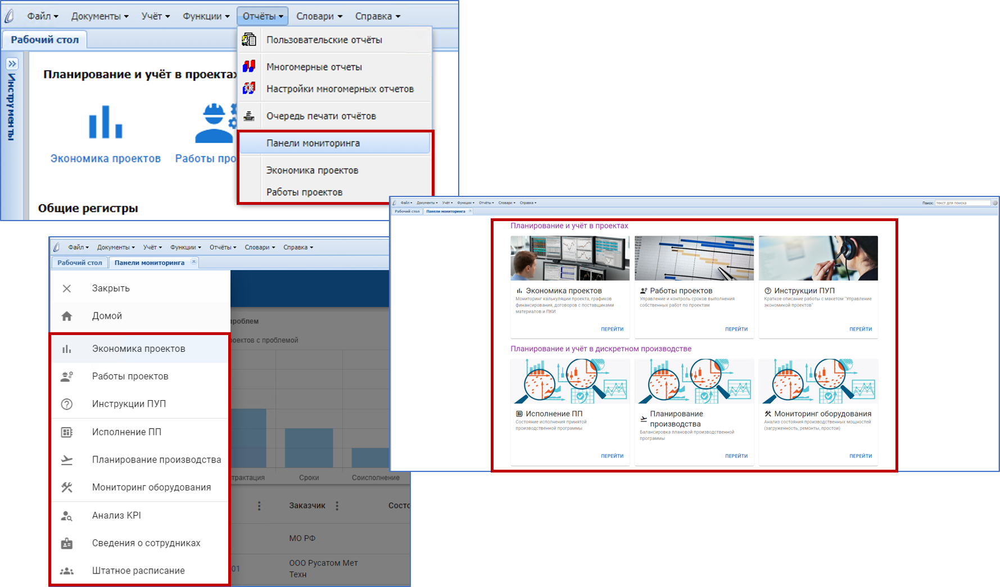
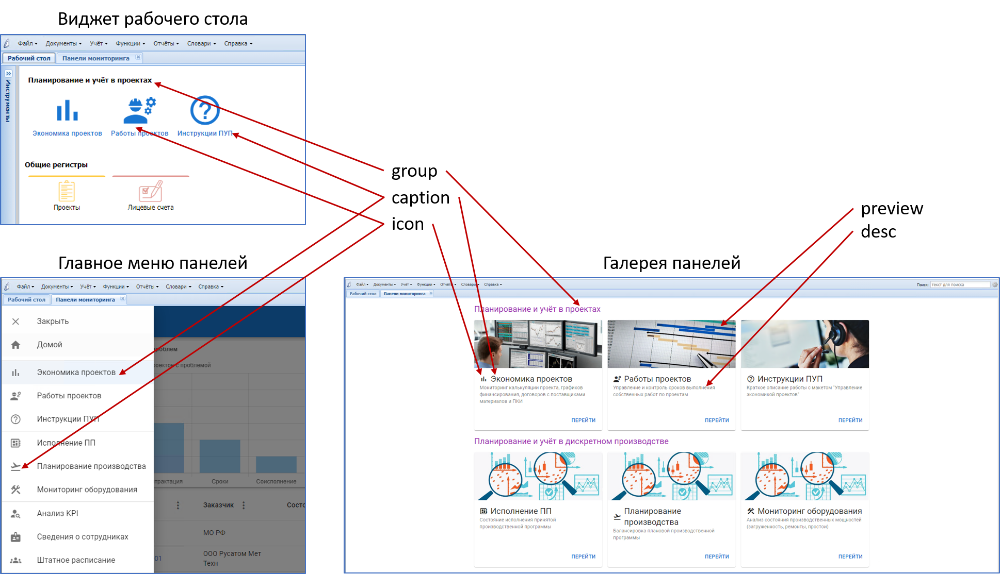
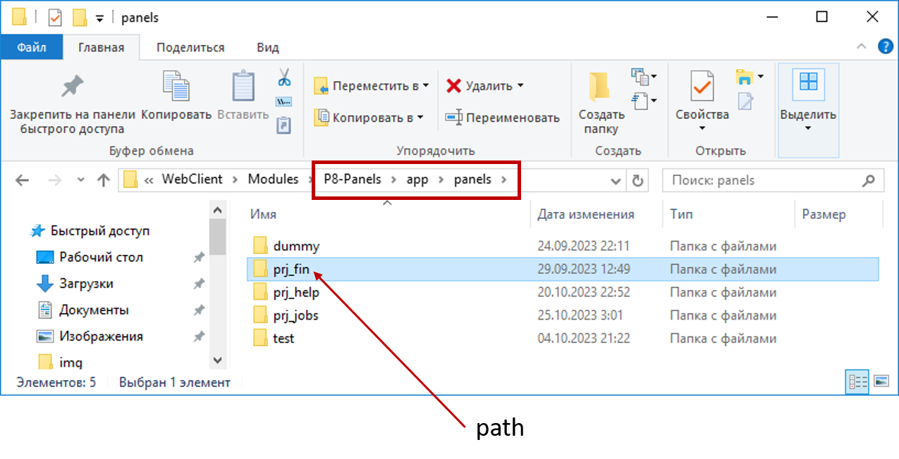
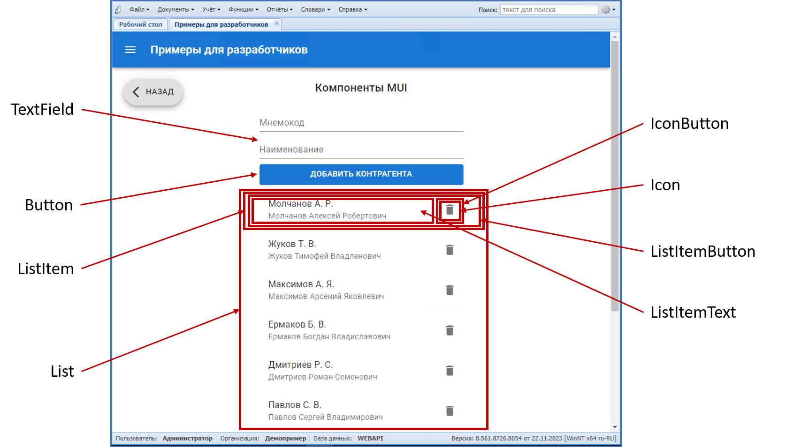
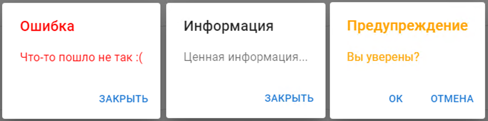
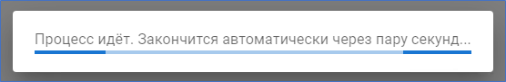

# P8-Panels - "Панели"

## Расширение к "ПАРУС 8 Онлайн"

## Оглавление

[Термины и сокращения](#термины-и-сокращения)\
[I. Назначение](#i-назначение)\
[II. Состав](#ii-состав)\
[III. Требования к разработчику](#iii-требования-к-разработчику)\
[IV. Установка](#iv-установка)\
[V. Подключение панелей](#v-подключение-панелей)\
[VI. Разработка панелей](#vi-разработка-панелей)

## Термины и сокращения

**Система** - "ПАРУС 8 Предприятие"\
**БД** - База Данных\
**СУБД** - Система Управления Базами Данных\
**Расширение** - программный комплекс, дополняющий функциональность той или иной программной системы. В контексте данного документа (если не указано иное) - описываемое расширение "Панели".\
**Фреймворк** - программная платформа, определяющая структуру программной системы, программное обеспечение, облегчающее разработку и объединение разных компонентов большого программного проекта. В контексте данного документа (если не указано иное) - описываемое расширение "Панели".\
**Панель** - представление данных и функций Системы, реализованное с применением описываемого фреймворка\
**SPA** - Single Page Application - технология разработки WEB-приложений, предполагающая динамическую генерацию интерфейса внутри одного HTML-документа, отображаемого браузером\
**HTML** - HyperText Markup Language — язык гипертекстовой разметки\
**CSS** - Cascading Style Sheets - каскадные таблицы стилей\
**DOM** - Document Object Model - объектная модель документа (в контексте данного документа - HTML)\
**JS** - JavaScript — мультипарадигменный интерпретируемый язык программирования\
**JSX** - JavaScript eXtension - расширение JavaScript, которое позволяет создавать деревья DOM с использованием синтаксиса, подобного XML\
**АРМ** - Автоматизированное Рабочее Место

## I. Назначение

Расширение представляет собой фреймворк, основной задачей которого является сокращение времени разработки нестандартных графических интерфейсов и панелей мониторинга, работающих в составе WEB-приложения "ПАРУС 8 Онлайн".

## II. Состав

В фреймворк входят:

-   [Библиотека расширения "P8-Panels-ParusOnlineExt.dll"](https://github.com/CITKParus/P8-Panels-ParusOnlineExt) для сервера приложений "ПАРУС 8 Онлайн" - обеспечивает низкоуровневое взаимодействие разрабатываемых панелей с Системой
-   Хранимые объекты сервера БД Системы, обеспечивающие обмен данными между панелями и учётными регистрами Системы
-   API для высокоуровневого взаимодействия с сервером БД Системы
-   API для взаимодействия разрабатываемых панелей с WEB-приложением "ПАРУС 8 Онлайн"
-   WEB-приложение "Парус 8 - Панели мониторинга", являющееся "точкой входа" для подключения реализуемых панелей, включающее в себя:
    -   Подключенные и настроенные библиотеки ["React"](https://react.dev/), ["React-Router"](https://reactrouter.com/), ["MUI"](https://mui.com/)
    -   Настроенный транспайлер ["Babel"](https://babeljs.io/)
    -   Настроенный сборщик WEB-приложений ["WebPack"](https://webpack.js.org/)
    -   Настроенный статический анализатор кода ["ESLint"]()
    -   Настройки среды разработки ["Visual Studio Code"](https://code.visualstudio.com/)
    -   Готовый контекст React-приложения
    -   Компоненты для отображения единого бокового меню подключенных панелей, галереи подключенных панелей, интеграции в рабочий стол WEB-приложения "ПАРУС 8 Онлайн"
    -   Готовые панели мониторинга для ряда прикланых приложений Системы

## III. Требования к разработчику

Для успешной разработки собственных панелей, с применением описываемого фреймворка потребуются знания следующих технологий:

-   HTML, CSS, JS, JSX
-   Разработка SPA WEB-приложений
-   Знакомство с основами работы перечисленных выше библиотек и системных средств (в первую очередь "React")
-   Знание архитектуры Системы, принципов работы и организации её серверной части

На видеохостинге YouTube можно ознакомиться с уроками и обучающими курсами по большинству из перечисленных технологий. Например, с [этими](https://www.youtube.com/results?search_query=%D0%BF%D0%BE%D0%BB%D0%BD%D1%8B%D0%B9+%D0%BA%D1%83%D1%80%D1%81+react).

## IV. Установка

1. Установите сервер приложений "ПАРУС 8 Онлайн" согласно документации (см. "Парус-Онлайн 2. Часть 1. Установка ГГГГ.ММ.docx").
2. Разместите на диске сервера приложений библиотеку расширения "P8-Panels-ParusOnlineExt", для этого скопируйте содержимое папки "bin" из [репозитория расширения "P8-Panels-ParusOnlineExt"](https://github.com/CITKParus/P8-Panels-ParusOnlineExt), например, в каталог "C:\p8web20\Ext\P8-Panels-ParusOnlineExt".
3. Подключите библиотеку расширения к серверу приложений "ПАРУС 8 Онлайн". Для этого добавьте ссылку на библиотеку в файл "Config\extensions.config" сервера приложений:

```
<?xml version="1.0"?>
<parus.extensions enabled="true" resolveKind="Static" viewsMode="Shared" rootPath="c:\p8web20\Ext\">
	<extensions>
		<extension assembly="P8PanelsParusOnlineExt" path="P8-Panels-ParusOnlineExt\bin\P8-Panels-ParusOnlineExt.dll"/>
	</extensions>
</parus.extensions>
```

Где:

-   `rootPath="c:\p8web20\Ext\"` - атрибут, указывающий на корневой каталог хранения расширений для сервера приложений "ПАРУС 8 Онлайн"
-   `path="P8-Panels-ParusOnlineExt\bin\P8-Panels-ParusOnlineExt.dll"` - атрибут, указывающий на каталог размещения библиотеки расширения "Панели" относительного коревого `rootPath`

4. Установите в файле конфигурации "PrecompiledApp.config" сервера приложений атрибут `updatable` в `true`:

```
<precompiledApp version="2" updatable="true"/>
```

5. Разместите WEB-приложение "Парус 8 - Панели мониторинга" на сервере приложений "ПАРУС 8 Онлайн". Для этого в каталоге "Modules" сервера приложений создайте подкаталог "P8-Panels" и проведите клонирование репозитория ["P8-Panels"](https://github.com/CITKParus/P8-Panels) в него:

```
git clone https://github.com/CITKParus/P8-Panels.git
```

6. Проведите компиляцию хранимых объектов БД из каталога "db" клонированного репозитория (компиляцию проводить под пользователем-владельцем схемы серверной части Системы, с последующей перекомпиляцией зависимых инвалидных объектов), затем исполните скрипт "grants.sql", размещённый в этом же каталоге.

7. Перезапустите сервер приложений "ПАРУС 8 Онлайн"

## V. Подключение панелей

### Интеграция в приложение, главное меню, галерею и меню панелей

Файл "p8panels.config", располагаемый в каталоге "Config" сервера приложений "ПАРУС 8 Онлайн", определяет какие панели подключены к WEB-приложению, порядок формирования пунктов главного меню "ПАРУС 8 Онлайн" для доступа к подключенным панелям, состав галереи панелей и бокового меню навигации WEB-приложения "Парус 8 - Панели мониторинга", работающего в контексте "ПАРУС 8 Онлайн".



В корневом каталоге репозитория ["P8-Panels"](https://github.com/CITKParus/P8-Panels) расположен файл "p8panels.config", содержащий конфигурацию поставляемых с расширением типовых панелей.

Данный файл конфигурации необходимо разместить локально, в каталоге "Config" сервера приложений "ПАРУС 8 Онлайн".
Например, если сервер приложений установлен в "c:\p8web20\WebClient", то путь к "p8panels.config" должен быть "c:\p8web20\WebClient\Config\p8panels.config".

Рассмотрим формат файла конфигурации панелей на примере. Ниже приведён фрагмет "p8panels.config" из поставки расширения.

```
<CITK.P8Panels>
    <MenuItems>
	    <App name="ProjectPlanning">
            <MenuItem parent="{BA073333-DFBC-4BA3-8EA7-172F3F6B4FEE}" separator="true"/>
            <MenuItem parent="{BA073333-DFBC-4BA3-8EA7-172F3F6B4FEE}" name="ShowPrjPanelsRoot" caption="Панели мониторинга" url="Modules/p8-panels/"/>
            <MenuItem parent="{BA073333-DFBC-4BA3-8EA7-172F3F6B4FEE}" separator="true"/>
            <MenuItem parent="{BA073333-DFBC-4BA3-8EA7-172F3F6B4FEE}" name="ShowPrjPanelFin" caption="Экономика проектов" panelName="PrjFin"/>
            ...
        </App>
    </MenuItems>
    <Panels urlBase="Modules/p8-panels/#/">
        <Panel
                name="PrjFin"
                group="Планирование и учёт в проектах"
                caption="Экономика проектов"
                desc="Мониторинг калькуляции проекта, графиков финансирования, договоров с поставщиками материалов и ПКИ"
                url="prj_fin"
                path="prj_fin"
                icon="bar_chart"
                showInPanelsList="true"
                preview="./img/prj_fin.png"/>
        ...
    </Panels>
</CITK.P8Panels>
```

Настройки хранятся в формате XML. Корневым тэгом документа должен быть `CITK.P8Panels`. Дочерними для него могут быть две ветки конфигурации:

-   `MenuItems` - настройка пунктов главного меню WEB-приложения "ПАРУС 8 Онлайн"
-   `Panels` - общий список панелей, подключаемых к приложению (не все панели обязательно выводить в виде пунктов меню)

`MenuItems` состоит из элементов `App`, каждый из которых определяет для какого из приложений Системы описываются пункты меню. `MenuItems` может содержать несколько элементов `App`. Каждый элемент `App` должен иметь обязательный атрибут `name`, определяющий код приложения Системы (см. колонку `APPCODE` в таблице `APPLIST`), в которое будут добавлены пункты меню. Дочерними для элемента `App` являются элементы `MenuItem`, каждый из которых описывает создаваемый расширением пункт меню. `App` может содержать несколько `MenuItem`. Каждый из `MenuItem` может иметь следующие атрибуты:

-   `parent` - обязательный, содержит GUID родительского пункта меню, к которому будет добавлен описываемый дочерний пункт (см. `P_MENUS_CREATE_*_MENU`, где `*` - код приложения Системы)
-   `separator` - необязательный, принимает значения "true" или "false", если "true" - создаваемый пункт меню будет разделителем, остальные атрибуты, описанные ниже будут проигнорированы
-   `name` - необязательный для `separator="true"`, в прочих случаях - обязательный, уникальное имя пункта меню
-   `caption` - необязательный для `separator="true"`, в прочих случаях - обязательный, видимый текст пункта меню
-   `panelName` - необязательный для `separator="true"` или если указан атрибут `url`, в прочих случаях - обязательный, определяет код панели, открываемой при выборе данного пункта меню конечным пользователем (коды панелей объявляются в секции `Panels` данного файла конфигурации, описана ниже)
-   `url` - необязательный для `separator="true"` или если указан атрибут `panelName`, в прочих случаях - обязательный, определяет URL, который будет открыт в отдельной закладке "ПАРУС 8 Онлайн" при выборе данного пункта меню конечным пользователем (в приведённом примере, для пункта меню "ShowPrjPanelsRoot" открывает домашнюю страницу WEB-приложения "Парус 8 - Панели мониторинга", отображающую галерею доступных панелей, см. ниже описание атрибута `urlBase` элемента `Panels`)

`Panels` - содержит список элементов `Panel`, описывающих подключенные панели. Элемент `Panels` имеет атрибут `urlBase`, определяющий корневой URL WEB-приложения "Парус 8 - Панели мониторинга", относительно него формируются URL панелей. Значение `urlBase` определяется физическим расположением WEB-приложения "Парус 8 - Панели мониторинга" на диске сервера приложений (см. пункт 5 в главе "IV. Установка"). В данном примеры, файлы WEB-приложения распологаются в каталоге "Modules/p8-panels" сервера приложений. Каждый из элементов `Panel`, дочерних для `Panels`, описывает одну панель и имеет следующие атрибуты:

-   `name` - обязательный, строка, указывается латиницей, определяет уникальное имя панели
-   `group` - необязательный, строка, указывается кириллицей, определяет имя группы, в которую входит панель (применяется при формировании галереи панелей, главного меню панелей и ссылок на рабочем столе)
-   `caption` - обязательный, строка, видимое наименование панели (применяется в галереи панелей, главном меню панелей, ссылках на рабочем столе, заголовках закладок)
-   `desc` - необязательный, строка,
-   `url` - обязательный, строка, указывается латиницей, относительй URL панели (по адресу `Panel.urlBase` + `Panel.Panels.url` сервер приложений "ПАРУС 8 Онлайн" будет выдавать HTML-страницу панели), для простоты навигации может повторять значение атрибута `path`
-   `path` - обязательный, строка, путь к исходному коду панели в структуре каталогов WEB-приложения "Парус 8 - Панели мониторинга" (панели должны размещаться в "app/panels", в данном атрибуте указыватся только имя каталога, созданного для панели в "app/panels")
-   `icon` - обязательный, строка, код иконки панели из символов шрифта [Google Material Icons](https://fonts.google.com/icons?icon.set=Material+Icons) (применяется при формировании галереи панелей, главного меню панелей и ссылок на рабочем столе)
-   `showInPanelsList` - обязательный, принимает значения "true" или "false", определяет отображение ссылки на панель в галереи панелей, главном меню панелей, виджете рабочего стола
-   `preview` - полный путь и имя файла из каталога "img" WEB-приложения "Парус 8 - Панели мониторинга" (в каталог могут быть добавлены пользовательские изображения), служит в качестве изображения панели в галерее панелей

На рисунках ниже проиллюстрировано применение атрибутов элемента `Panel`.




Подключение разработанных пользователем панелей осуществляется путём добавления элементов `Panels` в файл конфигурации (при необходимости и элементов `App\MenuItems`, если предполагается открытие панели через главное меню WEB-приложения "ПАРУС 8 Онлайн").

Изменения файла конфигурации в части элементов `MenuItems` требуют перезапуска сервера приложений "ПАРУС 8 Онлайн" и завершения/начала сеансов конечных пользователей.

> **Будьте внимательны при обновлении:** если в локальном файле "p8panels.config" содержится конфигурация пользовательских панелей, то его нельзя заменять копированием дистрибутивной версии файла при обновлении - будут утеряны сделанные настройки. В этом случае файл следует модифицировать экспертным путём, добавив в локальный "p8panels.config" изменения из дистрибутивного вручную.

### Интеграция в рабочий стол

WEB-приложение "ПАРУС 8 Онлайн" поддерживает возможность настройки и отображения рабочих столов. Их конфиругирование осуществляется специальной настройкой в формате XML, хранящейся в поле `APPDESKTOP` системной таблицы `APPLIST`. Подробнее о возможностях настройки и доступных элементах рабочих столов см. главу "4.3. Рабочий стол" в "Парус-Онлайн 2. Часть 2. WEB-клиент. Настройка ГГГГ.ММ.docx".

Ссылки для вызова разработанных и подключенных через "p8panels.config" панелей также могут быть размещены на рабочем столе приложений. Для этого применяется елемент `Frame` (см. документацию по "ПАРУС 8 Онлайн") и специально предусмотренный режим отображения меню панелей - `DESKTOP`.

Чтобы получить на рабочем столе приложения ссылки вызова панелей, добавьте в его XML-конфигурацию элемент следующего содержания:

```
	<Frame url="Modules/p8-panels/#/?mode=DESKTOP&group=ИМЯ_ГРУППЫ"/>
```

Где:

-   `Modules/p8-panels/#/` - путь к домашней странице WEB-приложения "Парус 8 - Панели мониторинга", указанный в атрибуте `Panels.urlBase` файла конфигурации "p8panels.config"
-   `mode=DESKTOP` - параметр вызова домашней страниы WEB-приложения "Парус 8 - Панели мониторинга", обязывающий сформировать меню панелей в специальном формате, для интеграции в рабочий стол
-   `group=ИМЯ_ГРУППЫ` - параметр вызова домашней страниы WEB-приложения "Парус 8 - Панели мониторинга", позволяющий ограничить набор формируемых ссылок на панели только одной их группой (см. выше описание атрибута `Panel.group` файла конфигурации "p8panels.config")

Место элемента `Frame` в структуре XML-конфигурации рабочего стола зависит от его текущего содержимого. Например, для рабочего стола по-умолчанию приложения "Планирование и учёт в проектах" это `Desktop\ContentContainer\Frame`:

```
<?xml version="1.0" encoding="utf-8"?>
<Desktop>
    <ContentContainer Layout="Vertical">
        <Frame url="Modules/p8-panels/#/?mode=DESKTOP&group=Планирование и учёт в проектах"/>
        <ContentContainer Layout="Horizontal" Flex="1">
            <QuickLaunch Flex="1">
                <QuickLaunchGroup Ident="acnts" Caption="Общие регистры">
                    <QuickLaunchItem Ident="b11" Caption="Проекты" Icon="Content/images/desktop/v2/GMZService04.png" Color="#fecc46">
                        <Action Type="OpenUnit">
                            <Parameters>
                                <Unitcode>Projects</Unitcode>
                                <Method/>
                                <Conditions>true</Conditions>
                            </Parameters>
                        </Action>
                    </QuickLaunchItem>
                    ...
                </QuickLaunchGroup>
            ...
            </QuickLaunch>
        ...
        </ContentContainer>
    ...
    </ContentContainer>
...
</Desktop>
```

## VI. Разработка панелей

> **Внимание:** данное руководство не является обучающим курсом по WEB-разработке как таковой. Изложенные ниже сведения о порядке реализации пользовательских панелей, даны с учётом приведённых ранее требований к разработчику.

### Общие сведения

Расширение "Панели" позволяет подключать нестандартные интерфейсы разрабатываемые на местах, без привлечения вендора. Это могут быть не только панели мониторинга, но и формы ввода данных, различные АРМ, выполняющие бизнес-функции в Системе.

С точки зрения клиенсткой части, Панели представляют собой функциональные компоненты React, автоматически (благодаря описанному выше файлу конфигурации) встраиваемые в систему маршрутизации WEB-приложения "Парус 8 - Панели мониторинга" (далее "приложения" или "WEB-приложения", если контекст явно не указывает на иное). Каждая панель состоит из:

-   Набора JS-объектов и функций, управляющих состоянием панели
-   Функций для обмена данными с сервером БД Системы и выполнения бизнес-процедур в ней
-   JSX разметки, отражающей смену состояния панели

Такая структура исходного кода панели продиктована архитектурными требованиями к функциональным React-компонентам. Каждая панель (и все необходимые для её функционирования JS-модули и вспомогательный файлы) размещается в отдельном каталоге (см. выше - "app/panels", здесь и далее каталоги указаны относительно корневого каталога размещения приложения, если явно не указано иное) WEB-приложения "Парус 8 - Панели мониторинга".

Каждая панель должна иметь в составе "index.js" - точку входа по умолчанию. "index.js" должен экспортировать фунциональный React-компонент панели с имененем `RootClass` (см. для примера "app/panels/prj_fin/index.js").

После добавления новых панелей в состав приложения необходима его "пересборка". Для этого предусмотрены преднастроенные скрипты `dev` и `build`. Скрипты размещены в секции `scripts` файла зависимостей `package.json` WEB-приложения. Исполнение скриптов сборки выполняется через пакетный менеджер `npm` из корневого каталога приложения:

```
REM Запуск скрипта для отладочной сборки
c:\inetpub\p8web20\WebClient\Modules\P8-Panels>npm run dev

REM Запуск скрипта финальной сборки
c:\inetpub\p8web20\WebClient\Modules\P8-Panels>npm run build
```

Скрипт финальной сборки формирует обновлённое WEB-приложение в каталоге "dist" и завершает работу. Скрипт отладочной сборки обновляет WEB-приложение в каталоге "dist" и остаётся в активном режиме, "слушая" измнения файлов исходного кода приложения и автоматически обновляя "dist", если таковые изменения будут зафиксированы. Это позволяет отлаживать панели не выполняя пересборку вручную.

После пересборки обновлённые/новые панели доступны конечному пользователю для эксплуатации через WEB-приложение "ПАРУС 8 Онлайн".

Серверная часть любой из панелей - набор хранимых процедур/функций/пакетов БД Системы. Состав объектов, их алгоритмы, входные параметры и выходные данные зависят от специфики панели и специально не регламентируются. Необходимо понимать, что с помощью специального API из клиентской JS-функции панели можно обращаться к хранимым объектам БД - исполнять их, передавать значения входных параметров (например, считанные из форм ввода, размещённых на панели), получать и отображать на панели значения выходных параметров исполненного серверного объекта (в виде таблиц, карточек, графиков и прочими способами, отвечающими функциональным требованиям реализуемой панели).

> **Обратите внимание:** некоторые из приведённых ниже примеров включены в специальную панель "Примеры для разработчиков", также доступную в поставке. Исходный код клиентской части панели доступен в "app/panels/samples", исходный код серверной части - в "db/PKG_P8PANELS_SAMPLES.pck" (для работы панели пакет должен быть откомпилирован в БД и на него должны быть выданы права на исполнение). Её описание можно увидеть в "p8panels.config" - `Panel.name="Samples"`. Панель сконфигурирована таким образом, чтобы не отображаться в галерее и главном меню панелей (`Panel.showInPanelsList=false`). Вы можете изменить это, или подключить её к пункту главного меню "ПАРУС 8 Онлайн", добавив в секцию `MenuItems` "p8panels.config", для любого из доступных приложений Системы, элементы `MenuItem`, обеспечивающие вызов панели с примерами:

```
<MenuItem parent="{GIUD_РОДИТЕЛЬСКОГО_ПУНКТА_МЕНЮ}" separator="true"/>
<MenuItem parent="{GIUD_РОДИТЕЛЬСКОГО_ПУНКТА_МЕНЮ}" name="ShowSamples" caption="Примеры для разработчиков" panelName="Samples"/>
```

### API для взаимодействия с сервером БД "ПАРУС 8 Предприятие"

Для исполнения хранимых процедур/функций БД Системы в составе расширения предусмотрен специальный API. Его подключение к компоненте панели осуществляется через контекст `BackEndСtx` ("app/context/backend.js").

В состав API входят:

-   `SERV_DATA_TYPE_STR` - константа для типа данных "строка", при описании параметров исполняемых хранимых объектов
-   `SERV_DATA_TYPE_NUMB` - константа для типа данных "число", при описании параметров исполняемых хранимых объектов
-   `SERV_DATA_TYPE_DATE` - константа для типа данных "дата", при описании параметров исполняемых хранимых объектов
-   `SERV_DATA_TYPE_CLOB` - константа для типа данных "текст", при описании параметров исполняемых хранимых объектов
-   `isRespErr` - функция, проверка результата исполнения серверного объекта на наличие ошибок
-   `getRespErrMessage` - функция, получение ошибки исполнения серверного объекта
-   `getRespPayload` - функция, получение выходных значений, полученных после успешного исполнения
-   `executeStored` -функция, асинхронное исполнение хранимой процедуры/функции БД Системы
-   `getConfig` - функция, асинхронное считывание параметров конфигурации, определённых в "p8panels.config" (возвращает их JSON-представление)

При формировании ответов, функции, получающие данные с сервера, возвращают типовые значения:

```
//Типовой успех
{
    SSTATUS: "OK",
    XPAYLOAD: Object
}

//Типовая ошибка
{
    SSTATUS: "ERR",
    SMESSAGE: String
}
```

Где:

-   `SSTATUS` - строка, состояние исполнения (`"OK"` - успех или `"ERR"` - ошибка)
-   `XPAYLOAD` - объект, полезная нагрузка, данные полученные от серверного объекта (отсутствует, если `SSTATUS = "ERR"`)
-   `SMESSAGE` - строка, текст сообщения об ошибке (отсутствует, если `SSTATUS = "OK"`)

#### `boolean isRespErr(Object)`

Проверка ответа сервера на наличие ошибок.

**Входные параметры:** обязательный, объект, результат вызова `executeStored`

**Результат:** `true` - если полученный на вход результат исполнения `executeStored` содержит ошибку, `false` - в остальных случаях

#### `String getRespErrMessage(Object)`

Считывание ошибки из типового ответа сервера.

**Входные параметры:** обязательный, объект, результат вызова `executeStored`

**Результат:** текст сообщения об ошибке - если полученный на вход результат исполнения `executeStored` содержит ошибку, пустая строка (`""`) - в остальных случаях

#### `Object getRespPayload(Object)`

Считывание полезной нагрузки из типового ответа сервера.

**Входные параметры:** обязательный, объект, результат вызова `executeStored` (вызов должен осуществляться с параметром `fullResponse = true`)

**Результат:** объект с данными, размещёнными в `XPAYLOAD` ответа сервера - если полученный на вход результат исполнения `executeStored` содержит полезную нагрузку, `null` - в остальных случаях

#### `async Object executeStored(Object)`

Исполнение хранимого объекта БД Системы (исполняемый объект должен быть "клиентским").

**Входные параметры:**

```
{
    stored,
    args,
    respArg,
    isArray,
    tagValueProcessor,
    attributeValueProcessor,
    loader = true,
    loaderMessage = "",
    throwError = true,
    showErrorMessage = true,
    fullResponse = false,
    spreadOutArguments = true
}
```

`stored` - обязательный, строка, имя исполняемого хранимого объекта (для пакетных - "ПАКЕТ.ОБЪЕКТ")\
`args` - необязательный, объект, описание параметров исполняемого хранимого объета вида: `{"ПАРАМЕТР": "ЗНАЧЕНИЕ"|{VALUE: "ЗНАЧЕНИЕ", SDATA_TYPE: SERV_DATA_TYPE_*}}` (если тип данных параметров не указан явно - произойдёт попытка их автоматического определения, с CLOB-параметрами это не всегда может произойти корректно)\
`respArg` - необязательный, строка, имя выходного параметра исполняемого объекта, значение которого необходимо вернуть как данные ответа (если не указан - возвращвется типовой ответ)\
`isArray`, `tagValueProcessor`, `attributeValueProcessor` - необязательны, функции, позволяющие провести корректировку парсинга XML-ответа сервера в JSON (сигнатура и назначение функций описаны в документации к [fast-xml-parser](https://github.com/NaturalIntelligence/fast-xml-parser/blob/HEAD/docs/v4/2.XMLparseOptions.md))\
`loader` - необязательный, логический, признак отображения типового индикатора процесса\
`loaderMessage` - необязательный, строка, текст индикатора процесса (при отсутствии будет использован типовой)\
`throwError` - необязательный, логический, признак генерации исключения, если `false` - возвращает ошибку в типовом формате\
`showErrorMessage` - необязательный, логический, признак отображения типового клиентского сообщение об ошибке, в случае её возникновения (только если `throwError = true`)\
`fullResponse` - необязательный, логический, признак возврата полного типового ответа сервера, если `false` - возвращается только содержимое `XPAYLOAD`\
`spreadOutArguments` - необязательный, логический, признак "разделения" значений выходных параметров исполняемого обхекта (игнорируется при наличии `respArg`), если `true` - `XPAYLOAD` будет содержать ответ в виде `{"ВЫХОДНОЙ_ПАРАМЕТР1": "ЗНАЧЕНИЕ", "ВЫХОДНОЙ_ПАРАМЕТР2": "ЗНАЧЕНИЕ", ...}`, если `false` - `XPAYLOAD` будет содержать ответ в виде `{XOUT_ARGUMENTS: [{SNAME: "ВЫХОДНОЙ_ПАРАМЕТР1", VALUE: "ЗНАЧЕНИЕ"}, {SNAME: "ВЫХОДНОЙ_ПАРАМЕТР2", VALUE: "ЗНАЧЕНИЕ"}, ...]}`

**Результат:** объект с данными, размещёнными в `XPAYLOAD` ответа сервера (если `fullResponse = false`) или полный типовой ответ (описан выше).

**Пример:**

```
import React, { useState, useContext } from "react"; //Классы React
import { BackEndСtx } from "../../context/backend"; //Контекст взаимодействия с сервером

//Функциональный компонент панели (или её части)
const MyPanel = () => {
    //Собственное состояние
    const [state, setState] = useState({ dataLoaded: false, data: [], filters: null, orders: null });

    //Подключение к контексту взаимодействия с сервером
    const { executeStored, SERV_DATA_TYPE_CLOB } = useContext(BackEndСtx);

    //Загрузка данных проектов с сервера
    const loadProjects = async (agentName) => {
        //Исполняем процедуру
        const data = await executeStored({
            stored: "UDO_P_GET_MY_DATA",
            args: {
                CFILTERS: { VALUE: state.filters, SDATA_TYPE: SERV_DATA_TYPE_CLOB },
                CORDERS: { VALUE: state.orders, SDATA_TYPE: SERV_DATA_TYPE_CLOB },
                SAGENT: agentName
            },
            respArg: "COUT"
        });
        //Отражаем данные в состоянии
        setState(pv => ({ ...pv, data: [...data], dataLoaded: true }));
    }
};

```

#### `async Object getConfig(Object)`

Получение содержимого "p8panels.config".

**Входные параметры:**

```
{
    loader = true,
    loaderMessage = "",
    throwError = true,
    showErrorMessage = true
}
```

`loader` - необязательный, логический, признак отображения типового индикатора процесса\
`loaderMessage` - необязательный, строка, текст индикатора процесса (при отсутствии будет использован типовой)\
`throwError` - необязательный, логический, признак генерации исключения, если `false` - возвращает ошибку в типовом формате\
`showErrorMessage` - необязательный, логический, признак отображения типового клиентского сообщения об ошибке, в случае её возникновения (только если `throwError = true`)

**Результат:** объект, типовой ответ, где `XPAYLOAD` объект вида (см. описание атрибутов выше, в описании "p8panels.config"):

```
{
    "MenuItems": {
        "App": [
            {
                "MenuItem": [
                    {
                        "parent": ...,
                        "name": ...,
                        "caption": ...,
                        "url": ...,
                        "separator": ...
                    },
                    ...
                ],
                "name": "Realiz"
            },
            ...
        ]
    },
    "Panels": {
        "Panel": [
            {
                "name": ...,
                "group": ...,
                "caption": ...,
                "desc": ...,
                "url": ...,
                "path": ...,
                "icon": ...,
                "showInPanelsList": ...,
                "preview": ...
            },
            ...
        ],
        "urlBase": ...
    }
}
```

### API для взаимодействия с WEB-приложением "ПАРУС 8 Онлайн"

Для взаимодействия панелей с пользовательским интерфейсом "ПАРУС 8 Онлайн" в составе расширения предусмотрен специальный API. Его подключение к компоненте панели осуществляется через контекст `ApplicationСtx` ("app/context/application.js").

В состав API входят:

-   `pOnlineShowTab` - функция, отображение типовой закладки "ПАРУС 8 Онлайн"
-   `pOnlineShowUnit` - функция, отображение раздела "ПАРУС 8 Онлайн" в модальном режиме
-   `pOnlineShowDocument` - функция, отображение раздела "ПАРУС 8 Онлайн" в модальном режиме с позиционированием/отбором по документу
-   `pOnlineShowDictionary` - функция, отображение раздела "ПАРУС 8 Онлайн" в режиме словаря
-   `pOnlineUserProcedure` - функция, исполнение "Пользовательской процедуры"
-   `pOnlineUserReport` - функция, печать "Пользовательского отчёта"

#### `String pOnlineShowTab(Object)`

Открывает типовую закладку пользовательского интерфейса WEB-приложения.

**Входные параметры:**

```
{
    id,
    url,
    caption,
    onClose
}
```

`id` - необязательный, строка, уникальный идентификатор закладки (ели закладка с таким `id` уже существует - будет осуществлено переключение на данную закладку)\
`url` - необязательный, строка, адрес страницы, отображаемой на закладке\
`onClose` - необязательный, функция вида `f(id)`, обработчик закрытия закладки (функция будет вызвана при закрытии закладки, в качестве параметра будет передан идентификатор закрытой закладки)

**Результат:** строка, идентификатор открытой закладки.

#### `undefined pOnlineShowUnit(Object)`

Открывает типовое модальное окно раздела Системы.

**Входные параметры:**

```
{
    unitCode,
    showMethod = "main",
    inputParameters
}
```

`unitCode` - обязательный, строка, код раздела Системы\
`showMethod` - необязательный, строка, метод вызова раздела Системы (если не указан - будет использован метод вызова "main")\
`inputParameters` - необязательный, массив объектов вида `[{name: ИМЯ_ПАРАМЕТРА, value: ЗНАЧЕНИЕ_ПАРАМЕТРА},...]`, параметры метода вызова раздела Системы

**Результат:** функция не возвращает значимого результата

#### `undefined pOnlineShowDocument(Object)`

Открывает типовое модальное окно раздела Системы с позиционированием/отбором по документу (в зависимости от настроек метода вызова).

**Входные параметры:**

```
{
    unitCode,
    document,
    showMethod = "main",
    inRnParameter = "in_RN"
}
```

`unitCode` - обязательный, строка, код раздела Системы\
`document` - обязательный, число, регистрационный номер документа или иной его идентификатор
`showMethod` - необязательный, строка, метод вызова раздела Системы (если не указан - будет использован метод вызова "main")\
`inRnParameter` - необязательный, строка, имя параметра метода вызова для позиционирования/отбора (если не указан, будет применён параметр метода вызова с именем "in_RN")

**Результат:** функция не возвращает значимого результата

#### `undefined pOnlineShowDictionary(Object)`

Открывает типовое модальное окно раздела Системы в режиме словаря (позволяет считать параметры выбранной записи через выходные значения метода вызова).

**Входные параметры:**

```
{
    unitCode,
    showMethod = "main",
    inputParameters,
    callBack
}
```

`unitCode` - обязательный, строка, код раздела Системы\
`showMethod` - необязательный, строка, метод вызова раздела Системы (если не указан - будет использован метод вызова "main")\
`inputParameters` - необязательный, массив объектов вида `[{name: ИМЯ_ПАРАМЕТРА, value: ЗНАЧЕНИЕ_ПАРАМЕТРА},...]`, параметры метода вызова раздела Системы\
`callBack` - необязательный, функция вида `f(result)`, будет вызвана при закрытии модального окна словаря, в качестве параметра `result` в функцию будет передан объект `{success, outParams}`. При этом `success` принимает значения `true` (пользователь нажал "ОК") или `false` (пользователь нажал "Отмена"), а `outParams` (при `success=true`) содержит объект вида "ключ-значение" `{ИМЯ_ВЫХОДНОГО_ПАРАМЕТРА: ЗНАЧЕНИЕ}`, где ключ - имя выходного параметра метода вызова, ключ - его значение для выбранной записи.

**Результат:** функция не возвращает значимого результата

#### `undefined pOnlineUserProcedure(Object)`

Вызывает "Пользовательскую процедуру" Системы (если процедура имеет визуализируемые параметры - будет отображён диалог для их ввода).

**Входные параметры:**

```
{
    code,
    inputParameters,
    callBack
}
```

`code` - обязательный, строка, мнемокод вызываемой пользовательской процедуры\
`inputParameters` - необязательный, массив объектов вида `[{name: ИМЯ_ПАРАМЕТРА, value: ЗНАЧЕНИЕ_ПАРАМЕТРА},...]`, значения параметров пользовательской процедуры (имеют более высокий приоритет, чем значения инизиализации в настройках пользовательской процедуры, однако менее низкий, чем значения сохраненные на форме)\
`callBack` - необязательный, функция вида `f(result)`, будет вызвана после исполнения пользовательской процедуры, в качестве параметра `result` в функцию будет передан объект `{success, outParams}`. При этом `success` принимает значения `true` (выполнена успешно) или `false` (была ошибка исполнения), а `outParams` (при `success=true`) содержит объект вида "ключ-значение" `{ИМЯ_ВЫХОДНОГО_ПАРАМЕТРА: ЗНАЧЕНИЕ}`, где ключ - имя выходного параметра процедуры, ключ - его значение.

**Результат:** функция не возвращает значимого результата

#### `undefined pOnlineUserReport(Object)`

Вызывает "Пользователький отчёт" Системы (если отчёт имеет визуализируемые параметры - будет отображён диалог для их ввода, отчёт исполняется аналогично его вызову штатным действием из типового раздела - через сервер отложенной печати).

**Входные параметры:**

```
{
    code,
    inputParameters
}
```

`code` - обязательный, строка, мнемокод вызываемого пользовательского отчёта\
`inputParameters` - необязательный, массив объектов вида `[{name: ИМЯ_ПАРАМЕТРА, value: ЗНАЧЕНИЕ_ПАРАМЕТРА},...]`, значения параметров пользовательского отчёта (имеют более высокий приоритет, чем значения инизиализации параметров в настройках отчёта, однако менее низкий, чем значения сохраненные на форме его вызова)

**Результат:** функция не возвращает значимого результата

Примеры (см. "app/panels/samples/p8online.js"):

```
import React, { useState, useContext } from "react"; //Классы React
import { Typography, Button, Divider } from "@mui/material"; //Интерфейсные элементы
import { ApplicationСtx } from "../../context/application"; //Контекст приложения

//Стили
const STYLES = {
    CONTAINER: { textAlign: "center", paddingTop: "20px" },
    TITLE: { paddingBottom: "15px" },
    DIVIDER: { margin: "15px" }
};

//Пример: API для взаимодействия с "ПАРУС 8 Онлайн"
const P8Online = ({ title }) => {
    //Собственное состояние
    const [agent, setAgent] = useState("");

    //Подключение к контексту приложения
    const { pOnlineShowUnit, pOnlineShowTab, pOnlineShowDocument, pOnlineShowDictionary } = useContext(ApplicationСtx);

    //Генерация содержимого
    return (
        <div style={STYLES.CONTAINER}>
            <Typography sx={STYLES.TITLE} variant={"h6"}>
                {title}
            </Typography>
            {/* Открыть новую закладку */}
            <Button variant="contained" onClick={() => pOnlineShowTab({ caption: "PARUS.COM", url: "https://www.parus.com" })}>
                Открыть закладку
            </Button>
            <Divider sx={STYLES.DIVIDER} />
            {/* Открыть раздел */}
            <Button
                variant="contained"
                onClick={() => {
                    pOnlineShowUnit({
                        unitCode: "Contracts"
                    });
                }}
            >
                Открыть раздел Договоры
            </Button>
            <Divider sx={STYLES.DIVIDER} />
            {/* Открыть раздел в режиме словаря */}
            <Button
                variant="contained"
                onClick={() => {
                    pOnlineShowDictionary({
                        unitCode: "AGNLIST",
                        inputParameters: [
                            {
                                name: "in_AGNABBR",
                                value: agent
                            }
                        ],
                        callBack: res => (res.success === true ? setAgent(res.outParameters.out_AGNABBR) : null)
                    });
                }}
            >
                Выбрать контрагента
            </Button>
            {/* Позиционирование/отбор документа */}
            {agent ? (
                <>
                    <Divider sx={STYLES.DIVIDER} />
                    <Button
                        variant="contained"
                        onClick={() => {
                            pOnlineShowDocument({
                                unitCode: "AGNLIST",
                                document: agent,
                                inRnParameter: "in_AGNABBR"
                            });
                        }}
                    >{`Показать контрагента "${agent}"`}</Button>
                </>
            ) : null}
        </div>
    );
};

```

### Компоненты пользовательского интерфейса

#### Типовые интерфейсные примитивы

##### Компоненты MUI

В состав фреймворка включена библиотека [MUI](https://mui.com/) версии 5. При разработке панелей могут быть использованы интерфейсные компоненты и разметка, поставляемые с ней.


Сочетая компоненты библиотеки [MUI](https://mui.com/) и описанный выше API для взаимодействия с Системой можно реализовать пользовательский интерфейс любой сложности. Для подключения компонента к панели достаточно импортировать его из модуля `"@mui/material"`.



Например, предложенный ниже компонент отображает список контрагентов (мнемокод и наименование последних 10 добавленных в Систему) с возможностью удаления (нажатие на элемент списка - открытие словаря "Контрагенты" с позиционированием на записи), форму добавления контрагента с указанным мнемокодом и наименованием (добавление производится в корневой каталог словаря "Контрагенты"):

```
import React, { useEffect, useContext, useCallback, useState } from "react"; //Классы React
import { Typography, Grid, List, ListItemButton, ListItem, ListItemText, IconButton, Icon, Button, TextField, Box } from "@mui/material"; //Интерфейсные элементы MUI
import { BackEndСtx } from "../../context/backend"; //Контекст взаимодействия с сервером
import { MessagingСtx } from "../../context/messaging"; //Контекст сообщений
import { ApplicationСtx } from "../../context/application"; //Контекст приложения

//Стили
const STYLES = {
    CONTAINER: { textAlign: "center", paddingTop: "20px" },
    TITLE: { paddingBottom: "15px" },
    LIST: { width: "100%", maxWidth: "600px", bgcolor: "background.paper" }
};

//Функциональный компонент с примером использования MUI
const Mui = ({ title }) => {
    //Собственное состояние - список контрагентов
    const [agents, setAgents] = useState([]);

    //Собственное состояние - форма добавления контрагента
    const [agentForm, setAgentForm] = useState({ agnAbbr: "", agnName: "" });

    //Подключение к контексту взаимодействия с сервером
    const { executeStored } = useContext(BackEndСtx);

    //Подключение к контексту сообщений
    const { showMsgWarn } = useContext(MessagingСtx);

    //Подключение к контексту приложения
    const { pOnlineShowDocument } = useContext(ApplicationСtx);

    //Загрузка списка контрагентов
    const agentsGet = useCallback(async () => {
        const data = await executeStored({
            stored: "PKG_P8PANELS_SAMPLES.AGNLIST_GET",
            respArg: "COUT"
        });
        setAgents([...data.AGENTS]);
    }, [executeStored]);

    //Добавление контрагента
    const agentInsert = useCallback(
        async (agnAbbr, agnName) => {
            await executeStored({
                stored: "PKG_P8PANELS_SAMPLES.AGNLIST_INSERT",
                args: {
                    SAGNABBR: agnAbbr,
                    SAGNNAME: agnName
                }
            });
            setAgentForm({ agnAbbr: "", agnName: "" });
            agentsGet();
        },
        [executeStored, agentsGet]
    );

    //Удаление контрагента
    const agentDelete = useCallback(
        async rn => {
            await executeStored({
                stored: "PKG_P8PANELS_SAMPLES.AGNLIST_DELETE",
                args: { NRN: rn }
            });
            agentsGet();
        },
        [executeStored, agentsGet]
    );

    //При нажатии на контрагента
    const handleAgnetClick = id => pOnlineShowDocument({ unitCode: "AGNLIST", document: id });

    //При добавлении контрагента
    const handleAgentInsert = () => agentInsert(agentForm.agnAbbr, agentForm.agnName);

    //При удалении контрагента
    const handleAgnetDeleteClick = id => showMsgWarn("Удалить контрагента?", () => agentDelete(id));

    //При вводе значения в форме
    const handleAgentFormChanged = e => {
        setAgentForm(pv => ({ ...pv, [e.target.name]: e.target.value }));
    };

    //При подключении компонента к странице
    useEffect(() => {
        agentsGet();
        // eslint-disable-next-line react-hooks/exhaustive-deps
    }, []);

    //Генерация содержимого
    return (
        <div style={STYLES.CONTAINER}>
            <Typography sx={STYLES.TITLE} variant={"h6"}>
                {title}
            </Typography>
            <Grid container spacing={0} direction="column" alignItems="center" justifyContent="center">
                <Grid item xs={3}>
                    <TextField
                        name="agnAbbr"
                        label="Мнемокод"
                        value={agentForm.agnAbbr}
                        variant="standard"
                        fullWidth
                        onChange={handleAgentFormChanged}
                    />
                    <TextField
                        name="agnName"
                        label="Наименование"
                        value={agentForm.agnName}
                        variant="standard"
                        fullWidth
                        onChange={handleAgentFormChanged}
                    />
                    <Box pt="10px">
                        <Button onClick={handleAgentInsert} variant="contained" fullWidth>
                            Добавить контрагента
                        </Button>
                    </Box>
                    <List sx={STYLES.LIST}>
                        {agents.map(a => (
                            <ListItem
                                key={a.NRN}
                                secondaryAction={
                                    <IconButton edge="end" title="Удалить контрагента" onClick={() => handleAgnetDeleteClick(a.NRN)}>
                                        <Icon>delete</Icon>
                                    </IconButton>
                                }
                                disablePadding
                            >
                                <ListItemButton onClick={() => handleAgnetClick(a.NRN)}>
                                    <ListItemText primary={a.SAGNABBR} secondary={a.SAGNNAME} />
                                </ListItemButton>
                            </ListItem>
                        ))}
                    </List>
                </Grid>
            </Grid>
        </div>
    );
};

```

Более подробно ознакомиться с исходным кодом примера можно в "app/panels/samples/mui.js". Документация по интерфейсным компонентам, включённым в [MUI](https://mui.com/) доступна на официальном сайте библиотеки.

> **Обратите внимание:** описываемые далее высокоуровневые компоненты фреймворка "Панели" построены, в том числе, с применением интерфейсных примитивов MUI. Как правило, они имеют префикс `P8P*` в имени: `P8PAppMessage`, `P8PAppInlineMessage`, `P8PAppProgress`, `P8PDataGrid` и т.д.

##### Сообщения "P8PAppMessage", "P8PAppInlineMessage"

При необходимости отображения сообщения пользователю панель может использовать компоненты `P8PAppMessage<TYPE>`, `P8PAppInlineMessage<TYPE>`, где `<TYPE> in ["Err", "Info", "Warn"]`, для сообщения об ошибке, информации или предупреждения соответственно. Их исходный код расположен в "app/components/p8p_app_message". Для подключения компонент к панели достаточно импортировать этот модуль.

Для удобства применения компонент реализованы функции-обёртки и компоненты-обёртки (декораторы), доступные через специальный контекст приложения - `MessagingСtx` ("app/context/messaging"). Их описание дано ниже.



###### `undefined showMsg(type, text, msgOnOk = null, msgOnCancel = null)`

Отображает модальное окно сообщения заданного типа.

**Входные параметры:**

`type` - обязательный, строка, тип отображаемого сообщения, `information|warning|error` (см. константу `MSG_TYPE` в "app/context/messaging_reducer" и константу `P8P_APP_MESSAGE_VARIANT` в "app/components/p8p_app_message")\
`text` - обязательный, строка, текст отображаемого сообщения\
`msgOnOk` - необязательный, функция, будет вызвана при нажатии на "ОК"/"ЗАКРЫТЬ" в сообщении
`msgOnCancel` - необязательный, функция, будет вызвана при нажатии на "ОТМЕНА" в сообщении (только для сообщений типа `warning`)

**Результат:** функция не возвращает значимого результата

###### `undefined showMsgErr(text, msgOnOk = null)`

Декоратор для `showMsg`, отображает модальное окно сообщения типа "Ошибка" (`type="error"`).

**Входные параметры:** аналогично `showMsg`

**Результат:** аналогично `showMsg`

###### `undefined showMsgInfo(text, msgOnOk = null)`

Декоратор для `showMsg`, отображает модальное окно сообщения типа "Информация" (`type="information"`).

**Входные параметры:** аналогично `showMsg`

**Результат:** аналогично `showMsg`

###### `undefined showMsgWarn(text, msgOnOk = null, msgOnCancel = null)`

Декоратор для `showMsg`, отображает модальное окно сообщения типа "Предупреждение" (`type="warning"`).

**Входные параметры:** аналогично `showMsg`

**Результат:** аналогично `showMsg`


###### `React.FunctionComponent InlineMsg(Object)`

Функциональный компонент React (применяется в JSX разметке: `<InlineMsg prop={value}.../>`) для отображения встраиваемого в разметку сообщения.

**Свойства компонента:**\
`variant` - строка, обязательное, вид сообщения (аналогично параметру `type` в `showMsg`)\
`text` - строка, обязательное, текст сообщения\
`onOk` - функция, необязательное, будет вызвана при нажатии на "ОК" в сообщении

###### `React.FunctionComponent InlineMsgErr(Object)`

Функциональный компонент React, декоратор для `InlineMsg`, формирует сообщение об ошибке (`variant="error"`).

**Свойства компонента:**\
`text` - строка, обязательное, текст сообщения\
`onOk` - функция, необязательное, будет вызвана при нажатии на "ОК" в сообщении

###### `React.FunctionComponent InlineMsgInfo(Object)`

Функциональный компонент React, декоратор для `InlineMsg`, формирует иформационное сообщение (`variant="information"`).

**Свойства компонента:**\
`text` - строка, обязательное, текст сообщения\
`onOk` - функция, необязательное, будет вызвана при нажатии на "ОК" в сообщении

###### `React.FunctionComponent InlineMsgWarn(Object)`

Функциональный компонент React, декоратор для `InlineMsg`, формирует предупредительное сообщение (`variant="warning"`).

**Свойства компонента:**\
`text` - строка, обязательное, текст сообщения\
`onOk` - функция, необязательное, будет вызвана при нажатии на "ОК" в сообщении

Ниже приведён пример использования описаных функций и компонент.

```
import React, { useContext, useState } from "react"; //Классы React
import { Typography, Divider, Button } from "@mui/material"; //Интерфейсные элементы
import { MessagingСtx } from "../../context/messaging"; //Контекст сообщений

//Стили
const STYLES = {
    CONTAINER: { textAlign: "center", paddingTop: "20px" },
    TITLE: { paddingBottom: "15px" },
    DIVIDER: { margin: "15px" }
};

//Функциональный компонент с примером использования сообщений
const Messages = ({ title }) => {
    //Собственное состояние
    const [state, setState] = useState({ inlineErr: true, inlineWarn: true, inlineInfo: true });

    //Подключение к контексту сообщений
    const { showMsgErr, showMsgWarn, showMsgInfo, InlineMsgErr, InlineMsgInfo, InlineMsgWarn } = useContext(MessagingСtx);

    //Генерация содержимого
    return (
        <div style={STYLES.CONTAINER}>
            <Typography sx={STYLES.TITLE} variant={"h6"}>
                {title}
            </Typography>
            {/* Сообщение об ошибке (диалог) */}
            <Button variant="contained" onClick={() => showMsgErr("Что-то пошло не так :(")}>
                Ошибка
            </Button>
            <Divider sx={STYLES.DIVIDER} />
            {/* Предупреждение (диалог) */}
            <Button
                variant="contained"
                onClick={() =>
                    showMsgWarn(
                        "Вы уверены?",
                        () => showMsgInfo("Делаем!"),
                        () => showMsgErr("Не делаем :(")
                    )
                }
            >
                Предупреждение
            </Button>
            <Divider sx={STYLES.DIVIDER} />
            {/* Информация (диалог) */}
            <Button variant="contained" onClick={() => showMsgInfo("Ценная информация...")}>
                Информация
            </Button>
            <Divider sx={STYLES.DIVIDER} />
            {/* Ошибка (встраиваемое) */}
            {state.inlineErr ? (
                <>
                    <InlineMsgErr text="Ошибка" onOk={() => setState(pv => ({ ...pv, inlineErr: false }))} />
                    <Divider sx={STYLES.DIVIDER} />
                </>
            ) : null}
            {/* Предупреждение (встраиваемое) */}
            {state.inlineWarn ? (
                <>
                    <InlineMsgWarn text="Предупреждение" onOk={() => setState(pv => ({ ...pv, inlineWarn: false }))} />
                    <Divider sx={STYLES.DIVIDER} />
                </>
            ) : null}
            {/* Информация (встраиваемое) */}
            {state.inlineInfo ? <InlineMsgInfo text="Информация" onOk={() => setState(pv => ({ ...pv, inlineInfo: false }))} /> : null}
        </div>
    );
};
```

Более подробно ознакомиться с исходным кодом примера можно в "app/panels/samples/messages.js".

##### Индикатор процесса "P8PAppProgress"

Для информирования пользователя о выполнении панелью асинхронных действий (например, обращений к серверу Системы), как правило, используются различные индикаторы выполнения процессов. Для этих целей в фреймворк "Панели" включен типовой индикатор процесса `P8PAppProgress` (исходный код компонента доступен в "app/components/p8p_app_progress").

Для удобства использования компонента в контексте приложения `MessagingСtx` ("app/context/messaging") реализованы декораторы `showLoader` и `hideLoader` (отображение и сокрытие индикатора процесса соответственно).



###### `undefined showMsg(message)`

Отображает модальный индикатор процесса с указанным сообщением.

**Входные параметры:**

`message` - необязательный, строка, текст индикатора (если не указан - будет отображено сообщение по умолчанию)

**Результат:** функция не возвращает значимого результата

###### `undefined hideLoader()`

Скрывает индикатора процесса.

**Входные параметры:** отсутствуют

**Результат:** функция не возвращает значимого результата

Ниже приведён пример использования индикатора процесса.

```
import React, { useContext } from "react"; //Классы React
import { Typography, Button } from "@mui/material"; //Интерфейсные элементы
import { MessagingСtx } from "../../context/messaging"; //Контекст сообщений

//Стили
const STYLES = {
    CONTAINER: { textAlign: "center", paddingTop: "20px" },
    TITLE: { paddingBottom: "15px" }
};

//Функциональный компонент с примером использования индикатора процесса
const Loader = ({ title }) => {
    //Подключение к контексту сообщений
    const { showLoader, hideLoader } = useContext(MessagingСtx);

    //Генерация содержимого
    return (
        <div style={STYLES.CONTAINER}>
            <Typography sx={STYLES.TITLE} variant={"h6"}>
                {title}
            </Typography>
            <Button
                onClick={() => {
                    showLoader("Процесс идёт. Закончится автоматически через пару секунд...");
                    setTimeout(hideLoader, 2000);
                }}
            >
                Показать индикатор процесса
            </Button>
        </div>
    );
};

```

Более подробно ознакомиться с исходным кодом примера можно в "app/panels/samples/loader.js".

> **Обратите внимание:** индикатор процесса применяется при выполнении `executeStored`, описанной выше. Индикатор автоматически появляется при начале обмена с сервером Системы и автоматически скрывается, после получения ответа. Это поведение можно изменить параметром `loader` вызова `executeStored` (параметр `loaderMessage` управляет отображаемым индикатором сообщения).

#### Высокоуровневые компоненты

##### Таблица данных "P8PDataGrid"

##### Графики "P8PChart"

##### Диаграмма ганта "P8PGantt"
