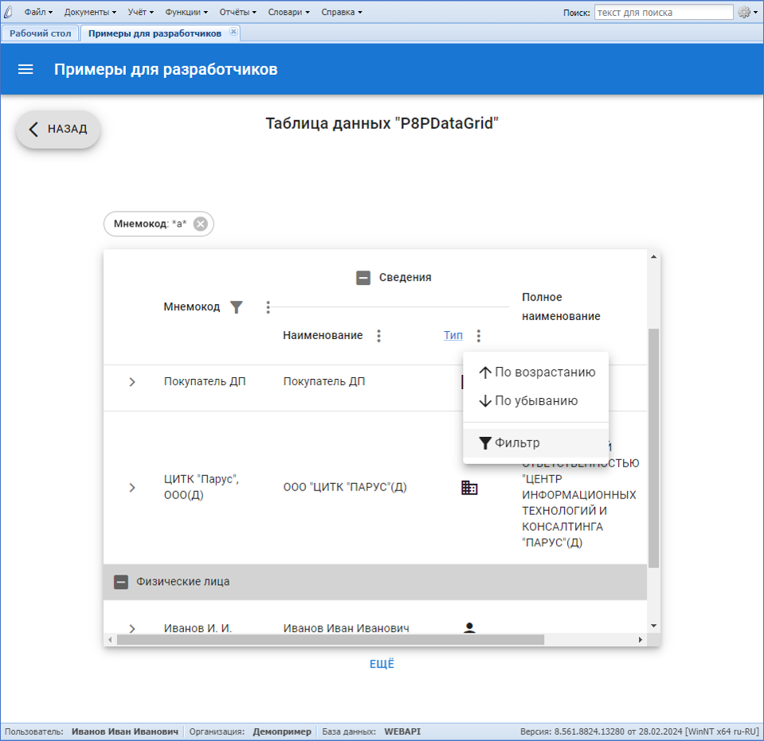
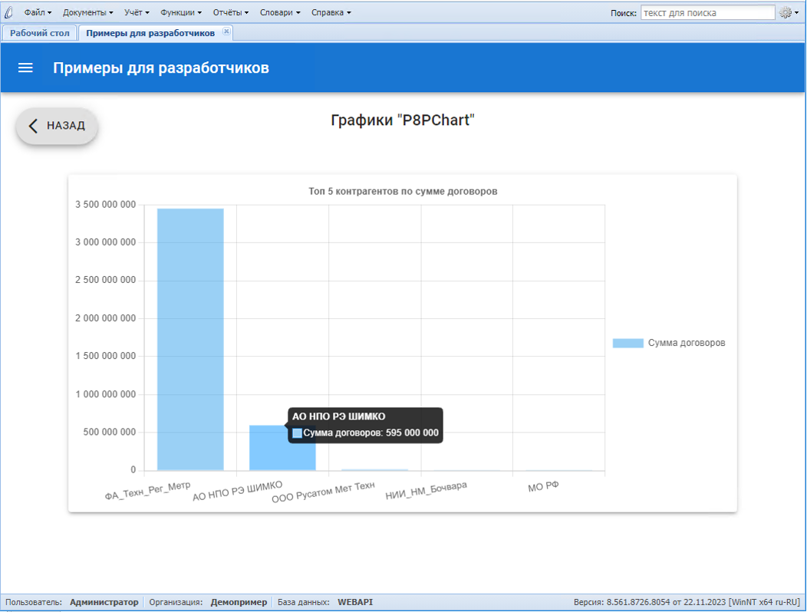
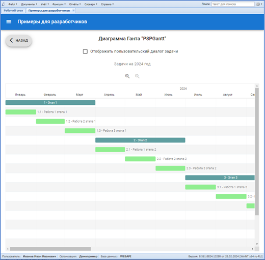
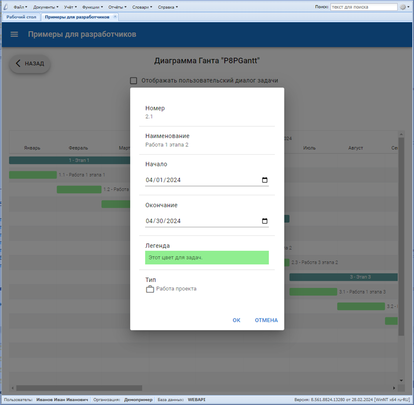
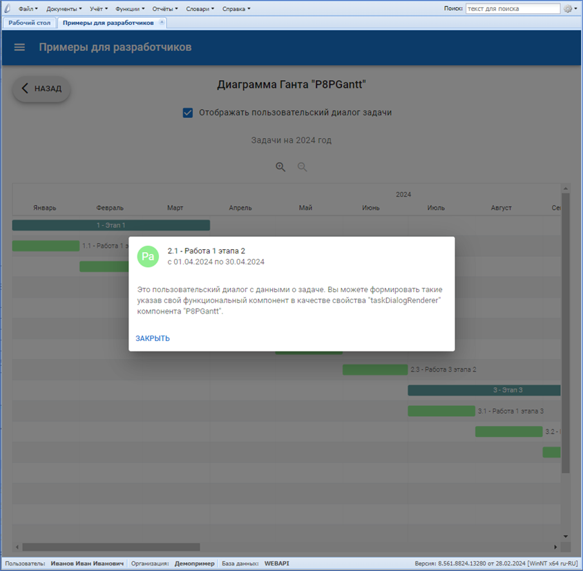
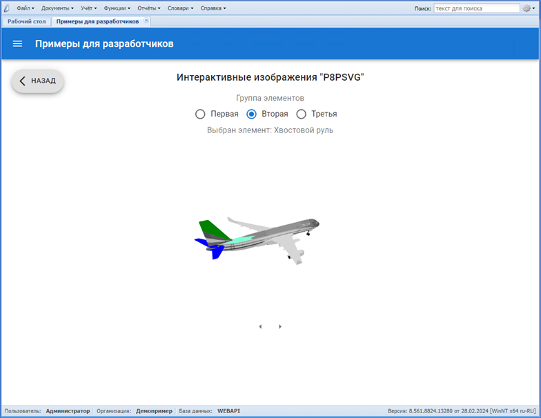

# P8-Panels - "Панели"

## Расширение к "ПАРУС 8 Онлайн"

## Оглавление

[Термины и сокращения](#термины-и-сокращения)\
[I. Назначение](#i-назначение)\
[II. Состав](#ii-состав)\
[III. Требования к разработчику](#iii-требования-к-разработчику)\
[IV. Установка](#iv-установка)\
[V. Подключение панелей](#v-подключение-панелей)\
[VI. Разработка панелей](#vi-разработка-панелей)

## Термины и сокращения

**Система** - "ПАРУС 8 Предприятие"\
**БД** - База Данных\
**СУБД** - Система Управления Базами Данных\
**Расширение** - программный комплекс, дополняющий функциональность той или иной программной системы. В контексте данного документа (если не указано иное) - описываемое расширение "Панели".\
**Фреймворк** - программная платформа, определяющая структуру программной системы, программное обеспечение, облегчающее разработку и объединение разных компонентов большого программного проекта. В контексте данного документа (если не указано иное) - описываемое расширение "Панели".\
**Панель** - представление данных и функций Системы, реализованное с применением описываемого фреймворка\
**SPA** - Single Page Application - технология разработки WEB-приложений, предполагающая динамическую генерацию интерфейса внутри одного HTML-документа, отображаемого браузером\
**HTML** - HyperText Markup Language — язык гипертекстовой разметки\
**CSS** - Cascading Style Sheets - каскадные таблицы стилей\
**DOM** - Document Object Model - объектная модель документа (в контексте данного документа - HTML)\
**JS** - JavaScript — мультипарадигменный интерпретируемый язык программирования\
**JSX** - JavaScript eXtension - расширение JavaScript, которое позволяет создавать деревья DOM с использованием синтаксиса, подобного XML\
**АРМ** - Автоматизированное Рабочее Место

## I. Назначение

Расширение представляет собой фреймворк, основной задачей которого является сокращение времени разработки нестандартных графических интерфейсов и панелей мониторинга, работающих в составе WEB-приложения "ПАРУС 8 Онлайн".

## II. Состав

В фреймворк входят:

-   [Библиотека расширения "P8-Panels-ParusOnlineExt.dll"](https://github.com/CITKParus/P8-Panels-ParusOnlineExt) для сервера приложений "ПАРУС 8 Онлайн" - обеспечивает низкоуровневое взаимодействие разрабатываемых панелей с Системой
-   Хранимые объекты сервера БД Системы, обеспечивающие обмен данными между панелями и учётными регистрами Системы
-   API для высокоуровневого взаимодействия с сервером БД Системы
-   API для взаимодействия разрабатываемых панелей с WEB-приложением "ПАРУС 8 Онлайн"
-   WEB-приложение "Парус 8 - Панели мониторинга", являющееся "точкой входа" для подключения реализуемых панелей, включающее в себя:
    -   Подключенные и настроенные библиотеки ["React"](https://react.dev/), ["React-Router"](https://reactrouter.com/), ["MUI"](https://mui.com/)
    -   Настроенный транспайлер ["Babel"](https://babeljs.io/)
    -   Настроенный сборщик WEB-приложений ["WebPack"](https://webpack.js.org/)
    -   Настроенный статический анализатор кода ["ESLint"]()
    -   Настройки среды разработки ["Visual Studio Code"](https://code.visualstudio.com/)
    -   Готовый контекст React-приложения
    -   Компоненты для отображения единого бокового меню подключенных панелей, галереи подключенных панелей, интеграции в рабочий стол WEB-приложения "ПАРУС 8 Онлайн"
    -   Готовые панели мониторинга для ряда прикланых приложений Системы

## III. Требования к разработчику

Для успешной разработки собственных панелей с применением описываемого фреймворка, потребуются знания следующих технологий:

-   HTML, CSS, JS, JSX
-   Разработка SPA WEB-приложений
-   Знакомство с основами работы перечисленных выше библиотек и системных средств (в первую очередь "React")
-   Знание архитектуры Системы, принципов работы и организации её серверной части

На видеохостинге YouTube можно ознакомиться с уроками и обучающими курсами по большинству из перечисленных технологий. Например, с [этими](https://www.youtube.com/results?search_query=%D0%BF%D0%BE%D0%BB%D0%BD%D1%8B%D0%B9+%D0%BA%D1%83%D1%80%D1%81+react).

## IV. Установка

1. Установите сервер приложений "ПАРУС 8 Онлайн" согласно документации (см. "Парус-Онлайн 2. Часть 1. Установка ГГГГ.ММ.docx"), требуется релиз от октября 2023 года и позднее.
2. Разместите на диске сервера приложений библиотеку расширения "P8-Panels-ParusOnlineExt", для этого скопируйте содержимое папки "bin" из [репозитория расширения "P8-Panels-ParusOnlineExt"](https://github.com/CITKParus/P8-Panels-ParusOnlineExt), например, в каталог "C:\p8web20\Ext\P8-Panels-ParusOnlineExt".
3. Подключите библиотеку расширения к серверу приложений "ПАРУС 8 Онлайн". Для этого добавьте ссылку на библиотеку в файл "Config\extensions.config" сервера приложений:

```
<?xml version="1.0"?>
<parus.extensions enabled="true" resolveKind="Static" viewsMode="Shared" rootPath="c:\p8web20\Ext\">
	<extensions>
		<extension assembly="P8PanelsParusOnlineExt" path="P8-Panels-ParusOnlineExt\bin\P8-Panels-ParusOnlineExt.dll"/>
	</extensions>
</parus.extensions>
```

Где:

-   `rootPath="c:\p8web20\Ext\"` - атрибут, указывающий на корневой каталог хранения расширений для сервера приложений "ПАРУС 8 Онлайн"
-   `path="P8-Panels-ParusOnlineExt\bin\P8-Panels-ParusOnlineExt.dll"` - атрибут, указывающий на каталог размещения библиотеки расширения "Панели" относительного коревого `rootPath`

4. Установите в файле конфигурации "PrecompiledApp.config" сервера приложений атрибут `updatable` в `true`:

```
<precompiledApp version="2" updatable="true"/>
```

5. Разместите WEB-приложение "Парус 8 - Панели мониторинга" на сервере приложений "ПАРУС 8 Онлайн". Для этого в каталоге "Modules" сервера приложений создайте подкаталог "P8-Panels" и проведите клонирование репозитория ["P8-Panels"](https://github.com/CITKParus/P8-Panels) в него:

```
git clone https://github.com/CITKParus/P8-Panels.git
```

6. Проведите компиляцию хранимых объектов БД из каталога "db" клонированного репозитория (компиляцию проводить под пользователем-владельцем схемы серверной части Системы, с последующей перекомпиляцией зависимых инвалидных объектов), затем исполните скрипт "grants.sql", размещённый в этом же каталоге.

7. Перезапустите сервер приложений "ПАРУС 8 Онлайн"

## V. Подключение панелей

### Интеграция в приложение, главное меню, галерею и меню панелей

Файл "p8panels.config", располагаемый в каталоге "Config" сервера приложений "ПАРУС 8 Онлайн", определяет какие панели подключены к WEB-приложению, порядок формирования пунктов главного меню "ПАРУС 8 Онлайн" для доступа к подключенным панелям, состав галереи панелей и бокового меню навигации WEB-приложения "Парус 8 - Панели мониторинга", работающего в контексте "ПАРУС 8 Онлайн".


В корневом каталоге репозитория ["P8-Panels"](https://github.com/CITKParus/P8-Panels) расположен файл "p8panels.config", содержащий конфигурацию поставляемых с расширением типовых панелей.

Данный файл конфигурации необходимо разместить локально, в каталоге "Config" сервера приложений "ПАРУС 8 Онлайн".
Например, если сервер приложений установлен в "c:\p8web20\WebClient", то путь к "p8panels.config" должен быть "c:\p8web20\WebClient\Config\p8panels.config".

Рассмотрим формат файла конфигурации панелей на примере. Ниже приведён фрагмет "p8panels.config" из поставки расширения.

```
<CITK.P8Panels>
    <MenuItems>
	    <App name="ProjectPlanning">
            <MenuItem parent="{BA073333-DFBC-4BA3-8EA7-172F3F6B4FEE}" separator="true"/>
            <MenuItem parent="{BA073333-DFBC-4BA3-8EA7-172F3F6B4FEE}" name="ShowPrjPanelsRoot" caption="Панели мониторинга" url="Modules/p8-panels/"/>
            <MenuItem parent="{BA073333-DFBC-4BA3-8EA7-172F3F6B4FEE}" separator="true"/>
            <MenuItem parent="{BA073333-DFBC-4BA3-8EA7-172F3F6B4FEE}" name="ShowPrjPanelFin" caption="Экономика проектов" panelName="PrjFin"/>
            ...
        </App>
    </MenuItems>
    <Panels urlBase="Modules/p8-panels/#/">
        <Panel
                name="PrjFin"
                group="Планирование и учёт в проектах"
                caption="Экономика проектов"
                desc="Мониторинг калькуляции проекта, графиков финансирования, договоров с поставщиками материалов и ПКИ"
                url="prj_fin"
                path="prj_fin"
                icon="bar_chart"
                showInPanelsList="true"
                preview="./img/prj_fin.png"/>
        ...
    </Panels>
</CITK.P8Panels>
```

Настройки хранятся в формате XML. Корневым тэгом документа должен быть `CITK.P8Panels`. Дочерними для него могут быть две ветки конфигурации:

-   `MenuItems` - настройка пунктов главного меню WEB-приложения "ПАРУС 8 Онлайн"
-   `Panels` - общий список панелей, подключаемых к приложению (не все панели обязательно выводить в виде пунктов меню)

`MenuItems` состоит из элементов `App`, каждый из которых определяет для какого из приложений Системы описываются пункты меню. `MenuItems` может содержать несколько элементов `App`. Каждый элемент `App` должен иметь обязательный атрибут `name`, определяющий код приложения Системы (см. колонку `APPCODE` в таблице `APPLIST`), в которое будут добавлены пункты меню. Дочерними для элемента `App` являются элементы `MenuItem`, каждый из которых описывает создаваемый расширением пункт меню. `App` может содержать несколько `MenuItem`. Каждый из `MenuItem` может иметь следующие атрибуты:

-   `parent` - обязательный, содержит GUID родительского пункта меню, к которому будет добавлен описываемый дочерний пункт (см. `P_MENUS_CREATE_*_MENU`, где `*` - код приложения Системы)
-   `separator` - необязательный, принимает значения "true" или "false", если "true" - создаваемый пункт меню будет разделителем, остальные атрибуты, описанные ниже будут проигнорированы
-   `name` - необязательный для `separator="true"`, в прочих случаях - обязательный, уникальное имя пункта меню
-   `caption` - необязательный для `separator="true"`, в прочих случаях - обязательный, видимый текст пункта меню
-   `panelName` - необязательный для `separator="true"` или если указан атрибут `url`, в прочих случаях - обязательный, определяет код панели, открываемой при выборе данного пункта меню конечным пользователем (коды панелей объявляются в секции `Panels` данного файла конфигурации, описана ниже)
-   `url` - необязательный для `separator="true"` или если указан атрибут `panelName`, в прочих случаях - обязательный, определяет URL, который будет открыт в отдельной закладке "ПАРУС 8 Онлайн" при выборе данного пункта меню конечным пользователем (в приведённом примере, для пункта меню "ShowPrjPanelsRoot" открывает домашнюю страницу WEB-приложения "Парус 8 - Панели мониторинга", отображающую галерею доступных панелей, см. ниже описание атрибута `urlBase` элемента `Panels`)

`Panels` - содержит список элементов `Panel`, описывающих подключенные панели. Элемент `Panels` имеет атрибут `urlBase`, определяющий корневой URL WEB-приложения "Парус 8 - Панели мониторинга", относительно него формируются URL панелей. Значение `urlBase` определяется физическим расположением WEB-приложения "Парус 8 - Панели мониторинга" на диске сервера приложений (см. пункт 5 в главе "IV. Установка"). В данном примеры, файлы WEB-приложения распологаются в каталоге "Modules/p8-panels" сервера приложений. Каждый из элементов `Panel`, дочерних для `Panels`, описывает одну панель и имеет следующие атрибуты:

-   `name` - обязательный, строка, указывается латиницей, определяет уникальное имя панели
-   `group` - необязательный, строка, указывается кириллицей, определяет имя группы, в которую входит панель (применяется при формировании галереи панелей, главного меню панелей и ссылок на рабочем столе)
-   `caption` - обязательный, строка, видимое наименование панели (применяется в галереи панелей, главном меню панелей, ссылках на рабочем столе, заголовках закладок)
-   `desc` - необязательный, строка,
-   `url` - обязательный, строка, указывается латиницей, относительй URL панели (по адресу `Panel.urlBase` + `Panel.Panels.url` сервер приложений "ПАРУС 8 Онлайн" будет выдавать HTML-страницу панели), для простоты навигации может повторять значение атрибута `path`
-   `path` - обязательный, строка, путь к исходному коду панели в структуре каталогов WEB-приложения "Парус 8 - Панели мониторинга" (панели должны размещаться в "app/panels", в данном атрибуте указыватся только имя каталога, созданного для панели в "app/panels")
-   `icon` - обязательный, строка, код иконки панели из символов шрифта [Google Material Icons](https://fonts.google.com/icons?icon.set=Material+Icons) (применяется при формировании галереи панелей, главного меню панелей и ссылок на рабочем столе)
-   `showInPanelsList` - обязательный, принимает значения "true" или "false", определяет отображение ссылки на панель в галереи панелей, главном меню панелей, виджете рабочего стола
-   `preview` - полный путь и имя файла из каталога "img" WEB-приложения "Парус 8 - Панели мониторинга" (в каталог могут быть добавлены пользовательские изображения), служит в качестве изображения панели в галерее панелей

На рисунках ниже проиллюстрировано применение атрибутов элемента `Panel`.


Подключение разработанных пользователем панелей осуществляется путём добавления элементов `Panels` в файл конфигурации (при необходимости и элементов `App\MenuItems`, если предполагается открытие панели через главное меню WEB-приложения "ПАРУС 8 Онлайн").

Изменения файла конфигурации в части элементов `MenuItems` требуют перезапуска сервера приложений "ПАРУС 8 Онлайн" и завершения/начала сеансов конечных пользователей.

> **Будьте внимательны при обновлении:** если в локальном файле "p8panels.config" содержится конфигурация пользовательских панелей, то его нельзя заменять копированием дистрибутивной версии файла при обновлении - будут утеряны сделанные настройки. В этом случае файл следует модифицировать экспертным путём, добавив в локальный "p8panels.config" изменения из дистрибутивного вручную.

### Интеграция в рабочий стол

WEB-приложение "ПАРУС 8 Онлайн" поддерживает возможность настройки и отображения рабочих столов. Их конфиругирование осуществляется специальной настройкой в формате XML, хранящейся в поле `APPDESKTOP` системной таблицы `APPLIST`. Подробнее о возможностях настройки и доступных элементах рабочих столов см. главу "4.3. Рабочий стол" в "Парус-Онлайн 2. Часть 2. WEB-клиент. Настройка ГГГГ.ММ.docx".

Ссылки для вызова разработанных и подключенных через "p8panels.config" панелей также могут быть размещены на рабочем столе приложений. Для этого применяется елемент `Frame` (см. документацию по "ПАРУС 8 Онлайн") и специально предусмотренный режим отображения меню панелей - `DESKTOP`.

Чтобы получить на рабочем столе приложения ссылки вызова панелей, добавьте в его XML-конфигурацию элемент следующего содержания:

```
	<Frame url="Modules/p8-panels/#/?mode=DESKTOP&group=ИМЯ_ГРУППЫ"/>
```

Где:

-   `Modules/p8-panels/#/` - путь к домашней странице WEB-приложения "Парус 8 - Панели мониторинга", указанный в атрибуте `Panels.urlBase` файла конфигурации "p8panels.config"
-   `mode=DESKTOP` - параметр вызова домашней страниы WEB-приложения "Парус 8 - Панели мониторинга", обязывающий сформировать меню панелей в специальном формате, для интеграции в рабочий стол
-   `group=ИМЯ_ГРУППЫ` - параметр вызова домашней страниы WEB-приложения "Парус 8 - Панели мониторинга", позволяющий ограничить набор формируемых ссылок на панели только одной их группой (см. выше описание атрибута `Panel.group` файла конфигурации "p8panels.config")

Место элемента `Frame` в структуре XML-конфигурации рабочего стола зависит от его текущего содержимого. Например, для рабочего стола по-умолчанию приложения "Планирование и учёт в проектах" это `Desktop\ContentContainer\Frame`:

```
<?xml version="1.0" encoding="utf-8"?>
<Desktop>
    <ContentContainer Layout="Vertical">
        <Frame url="Modules/p8-panels/#/?mode=DESKTOP&group=Планирование и учёт в проектах"/>
        <ContentContainer Layout="Horizontal" Flex="1">
            <QuickLaunch Flex="1">
                <QuickLaunchGroup Ident="acnts" Caption="Общие регистры">
                    <QuickLaunchItem Ident="b11" Caption="Проекты" Icon="Content/images/desktop/v2/GMZService04.png" Color="#fecc46">
                        <Action Type="OpenUnit">
                            <Parameters>
                                <Unitcode>Projects</Unitcode>
                                <Method/>
                                <Conditions>true</Conditions>
                            </Parameters>
                        </Action>
                    </QuickLaunchItem>
                    ...
                </QuickLaunchGroup>
            ...
            </QuickLaunch>
        ...
        </ContentContainer>
    ...
    </ContentContainer>
...
</Desktop>
```

## VI. Разработка панелей

> **Внимание:** данное руководство не является обучающим курсом по WEB-разработке как таковой. Изложенные ниже сведения о порядке реализации пользовательских панелей, даны с учётом приведённых ранее требований к разработчику.

### Общие сведения

Расширение "Панели" позволяет подключать нестандартные интерфейсы разрабатываемые на местах, без привлечения вендора. Это могут быть не только панели мониторинга, но и формы ввода данных, различные АРМ, выполняющие бизнес-функции в Системе.

С точки зрения клиенсткой части, Панели представляют собой функциональные компоненты React, автоматически (благодаря описанному выше файлу конфигурации) встраиваемые в систему маршрутизации WEB-приложения "Парус 8 - Панели мониторинга" (далее "приложения" или "WEB-приложения", если контекст явно не указывает на иное). Каждая панель состоит из:

-   Набора JS-объектов и функций, управляющих состоянием панели
-   Функций для обмена данными с сервером БД Системы и выполнения бизнес-процедур в ней
-   JSX разметки, отражающей смену состояния панели

Такая структура исходного кода панели продиктована архитектурными требованиями к функциональным React-компонентам. Каждая панель (и все необходимые для её функционирования JS-модули и вспомогательный файлы) размещается в отдельном каталоге (см. выше - "app/panels", здесь и далее каталоги указаны относительно корневого каталога размещения приложения, если явно не указано иное) WEB-приложения "Парус 8 - Панели мониторинга".

Каждая панель должна иметь в составе "index.js" - точку входа по умолчанию. "index.js" должен экспортировать фунциональный React-компонент панели с имененем `RootClass` (см. для примера "app/panels/prj_fin/index.js").

Если планируется разработка собственных панелей или доработка панелей из поставки, то необходимо локально установить библиотеки, включённые в фреймворк. Эти библиотеки необходимы для "пересборки" фреймворка после внесения изменений. Они не всходя в репозиторий, т.к. в него включен уже "собранный" вариант панелей, расположенный в "distr". Для установки библиотек следует воспользоваться пакетным менеджером `npm` и выполнить команду установки из корневого каталога приложения:

```
REM Установка зависимостей
c:\inetpub\p8web20\WebClient\Modules\P8-Panels>npm install
```

После добавления новых панелей в состав приложения (или внесения изменений в существующие) необходима его "пересборка". Для этого предусмотрены преднастроенные скрипты `dev` и `build`. Скрипты размещены в секции `scripts` файла зависимостей `package.json` WEB-приложения. Исполнение скриптов сборки выполняется через пакетный менеджер `npm` (должен быть установлен на рабочем месте разработчика) из корневого каталога приложения:

```
REM Запуск скрипта для отладочной сборки
c:\inetpub\p8web20\WebClient\Modules\P8-Panels>npm run dev

REM Запуск скрипта финальной сборки
c:\inetpub\p8web20\WebClient\Modules\P8-Panels>npm run build
```

Скрипт финальной сборки формирует обновлённое WEB-приложение в каталоге "dist" и завершает работу. Скрипт отладочной сборки обновляет WEB-приложение в каталоге "dist" и остаётся в активном режиме, "слушая" измнения файлов исходного кода приложения и автоматически обновляя "dist", если таковые изменения будут зафиксированы. Это позволяет отлаживать панели не выполняя пересборку вручную.

После пересборки обновлённые/новые панели доступны конечному пользователю для эксплуатации через WEB-приложение "ПАРУС 8 Онлайн".

Серверная часть любой из панелей - набор хранимых процедур/функций/пакетов БД Системы. Состав объектов, их алгоритмы, входные параметры и выходные данные зависят от специфики панели и специально не регламентируются. Необходимо понимать, что с помощью специального API из клиентской JS-функции панели можно обращаться к хранимым объектам БД - исполнять их, передавать значения входных параметров (например, считанные из форм ввода, размещённых на панели), получать и отображать на панели значения выходных параметров исполненного серверного объекта (в виде таблиц, карточек, графиков и прочими способами, отвечающими функциональным требованиям реализуемой панели).

> **Обратите внимание:** некоторые из приведённых ниже примеров включены в специальную панель "Примеры для разработчиков", также доступную в поставке. Исходный код клиентской части панели доступен в "app/panels/samples", исходный код серверной части - в "db/PKG_P8PANELS_SAMPLES.pck" (для работы панели пакет должен быть откомпилирован в БД и на него должны быть выданы права на исполнение). Её описание можно увидеть в "p8panels.config" - `Panel.name="Samples"`. Панель сконфигурирована таким образом, чтобы не отображаться в галерее и главном меню панелей (`Panel.showInPanelsList=false`). Вы можете изменить это, или подключить её к пункту главного меню "ПАРУС 8 Онлайн", добавив в секцию `MenuItems` "p8panels.config", для любого из доступных приложений Системы, элементы `MenuItem`, обеспечивающие вызов панели с примерами:

```
<MenuItem parent="{GIUD_РОДИТЕЛЬСКОГО_ПУНКТА_МЕНЮ}" separator="true"/>
<MenuItem parent="{GIUD_РОДИТЕЛЬСКОГО_ПУНКТА_МЕНЮ}" name="ShowSamples" caption="Примеры для разработчиков" panelName="Samples"/>
```

### API для взаимодействия с сервером БД "ПАРУС 8 Предприятие"

> **Обратите внимание:** Здесь и далее - описываемый API (как клиентский, так и серверный) не является финальным и может быть изменён с целью развития фреймворка. В этой связи, необходимо закладывать дополнительное время на обновления расширения "Панели", связанное с возможной необходимостью приведения разработанных самостоятельно интерфейсов (их клиентских и серверных частей) к доработанному API.

Для исполнения хранимых процедур/функций БД Системы в составе расширения предусмотрен специальный API. Его подключение к компоненте панели осуществляется через контекст `BackEndСtx` ("app/context/backend.js").

В состав API входят:

-   `SERV_DATA_TYPE_STR` - константа для типа данных "строка", при описании параметров исполняемых хранимых объектов
-   `SERV_DATA_TYPE_NUMB` - константа для типа данных "число", при описании параметров исполняемых хранимых объектов
-   `SERV_DATA_TYPE_DATE` - константа для типа данных "дата", при описании параметров исполняемых хранимых объектов
-   `SERV_DATA_TYPE_CLOB` - константа для типа данных "текст", при описании параметров исполняемых хранимых объектов
-   `isRespErr` - функция, проверка результата исполнения серверного объекта на наличие ошибок
-   `getRespErrMessage` - функция, получение ошибки исполнения серверного объекта
-   `getRespPayload` - функция, получение выходных значений, полученных после успешного исполнения
-   `executeStored` -функция, асинхронное исполнение хранимой процедуры/функции БД Системы
-   `getConfig` - функция, асинхронное считывание параметров конфигурации, определённых в "p8panels.config" (возвращает их JSON-представление)

При формировании ответов, функции, получающие данные с сервера, возвращают типовые значения:

```
//Типовой успех
{
    SSTATUS: "OK",
    XPAYLOAD: Object
}

//Типовая ошибка
{
    SSTATUS: "ERR",
    SMESSAGE: String
}
```

Где:

-   `SSTATUS` - строка, состояние исполнения (`"OK"` - успех или `"ERR"` - ошибка)
-   `XPAYLOAD` - объект, полезная нагрузка, данные полученные от серверного объекта (отсутствует, если `SSTATUS = "ERR"`)
-   `SMESSAGE` - строка, текст сообщения об ошибке (отсутствует, если `SSTATUS = "OK"`)

#### `boolean isRespErr(Object)`

Проверка ответа сервера на наличие ошибок.

**Входные параметры:** обязательный, объект, результат вызова `executeStored`

**Результат:** `true` - если полученный на вход результат исполнения `executeStored` содержит ошибку, `false` - в остальных случаях

#### `String getRespErrMessage(Object)`

Считывание ошибки из типового ответа сервера.

**Входные параметры:** обязательный, объект, результат вызова `executeStored`

**Результат:** текст сообщения об ошибке - если полученный на вход результат исполнения `executeStored` содержит ошибку, пустая строка (`""`) - в остальных случаях

#### `Object getRespPayload(Object)`

Считывание полезной нагрузки из типового ответа сервера.

**Входные параметры:** обязательный, объект, результат вызова `executeStored` (вызов должен осуществляться с параметром `fullResponse = true`)

**Результат:** объект с данными, размещёнными в `XPAYLOAD` ответа сервера - если полученный на вход результат исполнения `executeStored` содержит полезную нагрузку, `null` - в остальных случаях

#### `async Object executeStored(Object)`

Исполнение хранимого объекта БД Системы (исполняемый объект должен быть "клиентским").

**Входные параметры:**

```
{
    stored,
    args,
    respArg,
    isArray,
    tagValueProcessor,
    attributeValueProcessor,
    loader = true,
    loaderMessage = "",
    throwError = true,
    showErrorMessage = true,
    fullResponse = false,
    spreadOutArguments = true
}
```

`stored` - обязательный, строка, имя исполняемого хранимого объекта (для пакетных - "ПАКЕТ.ОБЪЕКТ")\
`args` - необязательный, объект, описание параметров исполняемого хранимого объета вида: `{"ПАРАМЕТР": "ЗНАЧЕНИЕ"|{VALUE: "ЗНАЧЕНИЕ", SDATA_TYPE: SERV_DATA_TYPE_*}}` (если тип данных параметров не указан явно - произойдёт попытка их автоматического определения, с CLOB-параметрами это не всегда может произойти корректно)\
`respArg` - необязательный, строка, имя выходного параметра исполняемого объекта, значение которого необходимо вернуть как данные ответа (если не указан - возвращвется типовой ответ)\
`isArray`, `tagValueProcessor`, `attributeValueProcessor` - необязательны, функции, позволяющие провести корректировку парсинга XML-ответа сервера в JSON (сигнатура и назначение функций описаны в документации к [fast-xml-parser](https://github.com/NaturalIntelligence/fast-xml-parser/blob/HEAD/docs/v4/2.XMLparseOptions.md))\
`loader` - необязательный, логический, признак отображения типового индикатора процесса\
`loaderMessage` - необязательный, строка, текст индикатора процесса (при отсутствии будет использован типовой)\
`throwError` - необязательный, логический, признак генерации исключения, если `false` - возвращает ошибку в типовом формате\
`showErrorMessage` - необязательный, логический, признак отображения типового клиентского сообщение об ошибке, в случае её возникновения (только если `throwError = true`)\
`fullResponse` - необязательный, логический, признак возврата полного типового ответа сервера, если `false` - возвращается только содержимое `XPAYLOAD`\
`spreadOutArguments` - необязательный, логический, признак "разделения" значений выходных параметров исполняемого обхекта (игнорируется при наличии `respArg`), если `true` - `XPAYLOAD` будет содержать ответ в виде `{"ВЫХОДНОЙ_ПАРАМЕТР1": "ЗНАЧЕНИЕ", "ВЫХОДНОЙ_ПАРАМЕТР2": "ЗНАЧЕНИЕ", ...}`, если `false` - `XPAYLOAD` будет содержать ответ в виде `{XOUT_ARGUMENTS: [{SNAME: "ВЫХОДНОЙ_ПАРАМЕТР1", VALUE: "ЗНАЧЕНИЕ"}, {SNAME: "ВЫХОДНОЙ_ПАРАМЕТР2", VALUE: "ЗНАЧЕНИЕ"}, ...]}`

**Результат:** объект с данными, размещёнными в `XPAYLOAD` ответа сервера (если `fullResponse = false`) или полный типовой ответ (описан выше).

**Пример:**

```
import React, { useState, useContext } from "react"; //Классы React
import { BackEndСtx } from "../../context/backend"; //Контекст взаимодействия с сервером

//Функциональный компонент панели (или её части)
const MyPanel = () => {
    //Собственное состояние
    const [state, setState] = useState({ dataLoaded: false, data: [], filters: null, orders: null });

    //Подключение к контексту взаимодействия с сервером
    const { executeStored, SERV_DATA_TYPE_CLOB } = useContext(BackEndСtx);

    //Загрузка данных проектов с сервера
    const loadProjects = async (agentName) => {
        //Исполняем процедуру
        const data = await executeStored({
            stored: "UDO_P_GET_MY_DATA",
            args: {
                CFILTERS: { VALUE: state.filters, SDATA_TYPE: SERV_DATA_TYPE_CLOB },
                CORDERS: { VALUE: state.orders, SDATA_TYPE: SERV_DATA_TYPE_CLOB },
                SAGENT: agentName
            },
            respArg: "COUT"
        });
        //Отражаем данные в состоянии
        setState(pv => ({ ...pv, data: [...data], dataLoaded: true }));
    }
};

```

#### `async Object getConfig(Object)`

Получение содержимого "p8panels.config".

**Входные параметры:**

```
{
    loader = true,
    loaderMessage = "",
    throwError = true,
    showErrorMessage = true
}
```

`loader` - необязательный, логический, признак отображения типового индикатора процесса\
`loaderMessage` - необязательный, строка, текст индикатора процесса (при отсутствии будет использован типовой)\
`throwError` - необязательный, логический, признак генерации исключения, если `false` - возвращает ошибку в типовом формате\
`showErrorMessage` - необязательный, логический, признак отображения типового клиентского сообщения об ошибке, в случае её возникновения (только если `throwError = true`)

**Результат:** объект, типовой ответ, где `XPAYLOAD` объект вида (см. описание атрибутов выше, в описании "p8panels.config"):

```
{
    "MenuItems": {
        "App": [
            {
                "MenuItem": [
                    {
                        "parent": ...,
                        "name": ...,
                        "caption": ...,
                        "url": ...,
                        "separator": ...
                    },
                    ...
                ],
                "name": "Realiz"
            },
            ...
        ]
    },
    "Panels": {
        "Panel": [
            {
                "name": ...,
                "group": ...,
                "caption": ...,
                "desc": ...,
                "url": ...,
                "path": ...,
                "icon": ...,
                "showInPanelsList": ...,
                "preview": ...
            },
            ...
        ],
        "urlBase": ...
    }
}
```

### API для взаимодействия с WEB-приложением "ПАРУС 8 Онлайн"

Для взаимодействия панелей с пользовательским интерфейсом "ПАРУС 8 Онлайн" в составе расширения предусмотрен специальный API. Его подключение к компоненте панели осуществляется через контекст `ApplicationСtx` ("app/context/application.js").

В состав API входят:

-   `pOnlineShowTab` - функция, отображение типовой закладки "ПАРУС 8 Онлайн"
-   `pOnlineShowUnit` - функция, отображение раздела "ПАРУС 8 Онлайн" в модальном режиме
-   `pOnlineShowDocument` - функция, отображение раздела "ПАРУС 8 Онлайн" в модальном режиме с позиционированием/отбором по документу
-   `pOnlineShowDictionary` - функция, отображение раздела "ПАРУС 8 Онлайн" в режиме словаря
-   `pOnlineUserProcedure` - функция, исполнение "Пользовательской процедуры"
-   `pOnlineUserReport` - функция, печать "Пользовательского отчёта"

#### `String pOnlineShowTab(Object)`

Открывает типовую закладку пользовательского интерфейса WEB-приложения.

**Входные параметры:**

```
{
    id,
    url,
    caption,
    onClose
}
```

`id` - необязательный, строка, уникальный идентификатор закладки (ели закладка с таким `id` уже существует - будет осуществлено переключение на данную закладку)\
`url` - необязательный, строка, адрес страницы, отображаемой на закладке\
`onClose` - необязательный, функция вида `f(id)`, обработчик закрытия закладки (функция будет вызвана при закрытии закладки, в качестве параметра будет передан идентификатор закрытой закладки)

**Результат:** строка, идентификатор открытой закладки.

#### `undefined pOnlineShowUnit(Object)`

Открывает типовое модальное окно раздела Системы.

**Входные параметры:**

```
{
    unitCode,
    showMethod = "main",
    inputParameters
}
```

`unitCode` - обязательный, строка, код раздела Системы\
`showMethod` - необязательный, строка, метод вызова раздела Системы (если не указан - будет использован метод вызова "main")\
`inputParameters` - необязательный, массив объектов вида `[{name: ИМЯ_ПАРАМЕТРА, value: ЗНАЧЕНИЕ_ПАРАМЕТРА},...]`, параметры метода вызова раздела Системы

**Результат:** функция не возвращает значимого результата

#### `undefined pOnlineShowDocument(Object)`

Открывает типовое модальное окно раздела Системы с позиционированием/отбором по документу (в зависимости от настроек метода вызова).

**Входные параметры:**

```
{
    unitCode,
    document,
    showMethod = "main",
    inRnParameter = "in_RN"
}
```

`unitCode` - обязательный, строка, код раздела Системы\
`document` - обязательный, число, регистрационный номер документа или иной его идентификатор
`showMethod` - необязательный, строка, метод вызова раздела Системы (если не указан - будет использован метод вызова "main")\
`inRnParameter` - необязательный, строка, имя параметра метода вызова для позиционирования/отбора (если не указан, будет применён параметр метода вызова с именем "in_RN")

**Результат:** функция не возвращает значимого результата

#### `undefined pOnlineShowDictionary(Object)`

Открывает типовое модальное окно раздела Системы в режиме словаря (позволяет считать параметры выбранной записи через выходные значения метода вызова).

**Входные параметры:**

```
{
    unitCode,
    showMethod = "main",
    inputParameters,
    callBack
}
```

`unitCode` - обязательный, строка, код раздела Системы\
`showMethod` - необязательный, строка, метод вызова раздела Системы (если не указан - будет использован метод вызова "main")\
`inputParameters` - необязательный, массив объектов вида `[{name: ИМЯ_ПАРАМЕТРА, value: ЗНАЧЕНИЕ_ПАРАМЕТРА},...]`, параметры метода вызова раздела Системы\
`callBack` - необязательный, функция вида `f(result)`, будет вызвана при закрытии модального окна словаря, в качестве параметра `result` в функцию будет передан объект `{success, outParams}`. При этом `success` принимает значения `true` (пользователь нажал "ОК") или `false` (пользователь нажал "Отмена"), а `outParams` (при `success=true`) содержит объект вида "ключ-значение" `{ИМЯ_ВЫХОДНОГО_ПАРАМЕТРА: ЗНАЧЕНИЕ}`, где ключ - имя выходного параметра метода вызова, ключ - его значение для выбранной записи.

**Результат:** функция не возвращает значимого результата

#### `undefined pOnlineUserProcedure(Object)`

Вызывает "Пользовательскую процедуру" Системы (если процедура имеет визуализируемые параметры - будет отображён диалог для их ввода).

**Входные параметры:**

```
{
    code,
    inputParameters,
    callBack
}
```

`code` - обязательный, строка, мнемокод вызываемой пользовательской процедуры\
`inputParameters` - необязательный, массив объектов вида `[{name: ИМЯ_ПАРАМЕТРА, value: ЗНАЧЕНИЕ_ПАРАМЕТРА},...]`, значения параметров пользовательской процедуры (имеют более высокий приоритет, чем значения инизиализации в настройках пользовательской процедуры, однако менее низкий, чем значения сохраненные на форме)\
`callBack` - необязательный, функция вида `f(result)`, будет вызвана после исполнения пользовательской процедуры, в качестве параметра `result` в функцию будет передан объект `{success, outParams}`. При этом `success` принимает значения `true` (выполнена успешно) или `false` (была ошибка исполнения), а `outParams` (при `success=true`) содержит объект вида "ключ-значение" `{ИМЯ_ВЫХОДНОГО_ПАРАМЕТРА: ЗНАЧЕНИЕ}`, где ключ - имя выходного параметра процедуры, ключ - его значение.

**Результат:** функция не возвращает значимого результата

#### `undefined pOnlineUserReport(Object)`

Вызывает "Пользователький отчёт" Системы (если отчёт имеет визуализируемые параметры - будет отображён диалог для их ввода, отчёт исполняется аналогично его вызову штатным действием из типового раздела - через сервер отложенной печати).

**Входные параметры:**

```
{
    code,
    inputParameters
}
```

`code` - обязательный, строка, мнемокод вызываемого пользовательского отчёта\
`inputParameters` - необязательный, массив объектов вида `[{name: ИМЯ_ПАРАМЕТРА, value: ЗНАЧЕНИЕ_ПАРАМЕТРА},...]`, значения параметров пользовательского отчёта (имеют более высокий приоритет, чем значения инизиализации параметров в настройках отчёта, однако менее низкий, чем значения сохраненные на форме его вызова)

**Результат:** функция не возвращает значимого результата

Примеры (см. "app/panels/samples/p8online.js"):

```
import React, { useState, useContext } from "react"; //Классы React
import { Typography, Button, Divider } from "@mui/material"; //Интерфейсные элементы
import { ApplicationСtx } from "../../context/application"; //Контекст приложения

//Стили
const STYLES = {
    CONTAINER: { textAlign: "center", paddingTop: "20px" },
    TITLE: { paddingBottom: "15px" },
    DIVIDER: { margin: "15px" }
};

//Пример: API для взаимодействия с "ПАРУС 8 Онлайн"
const P8Online = ({ title }) => {
    //Собственное состояние
    const [agent, setAgent] = useState("");

    //Подключение к контексту приложения
    const { pOnlineShowUnit, pOnlineShowTab, pOnlineShowDocument, pOnlineShowDictionary } = useContext(ApplicationСtx);

    //Генерация содержимого
    return (
        <div style={STYLES.CONTAINER}>
            <Typography sx={STYLES.TITLE} variant={"h6"}>
                {title}
            </Typography>
            {/* Открыть новую закладку */}
            <Button variant="contained" onClick={() => pOnlineShowTab({ caption: "PARUS.COM", url: "https://www.parus.com" })}>
                Открыть закладку
            </Button>
            <Divider sx={STYLES.DIVIDER} />
            {/* Открыть раздел */}
            <Button
                variant="contained"
                onClick={() => {
                    pOnlineShowUnit({
                        unitCode: "Contracts"
                    });
                }}
            >
                Открыть раздел Договоры
            </Button>
            <Divider sx={STYLES.DIVIDER} />
            {/* Открыть раздел в режиме словаря */}
            <Button
                variant="contained"
                onClick={() => {
                    pOnlineShowDictionary({
                        unitCode: "AGNLIST",
                        inputParameters: [
                            {
                                name: "in_AGNABBR",
                                value: agent
                            }
                        ],
                        callBack: res => (res.success === true ? setAgent(res.outParameters.out_AGNABBR) : null)
                    });
                }}
            >
                Выбрать контрагента
            </Button>
            {/* Позиционирование/отбор документа */}
            {agent ? (
                <>
                    <Divider sx={STYLES.DIVIDER} />
                    <Button
                        variant="contained"
                        onClick={() => {
                            pOnlineShowDocument({
                                unitCode: "AGNLIST",
                                document: agent,
                                inRnParameter: "in_AGNABBR"
                            });
                        }}
                    >{`Показать контрагента "${agent}"`}</Button>
                </>
            ) : null}
        </div>
    );
};

```

### Компоненты пользовательского интерфейса

#### Типовые интерфейсные примитивы

##### Компоненты MUI

В состав фреймворка включена библиотека [MUI](https://mui.com/) версии 5. При разработке панелей могут быть использованы интерфейсные компоненты и разметка, поставляемые с ней.


Сочетая компоненты библиотеки [MUI](https://mui.com/) и описанный выше API для взаимодействия с Системой можно реализовать пользовательский интерфейс любой сложности. Для подключения компонента к панели достаточно импортировать его из модуля `"@mui/material"`.


Например, предложенный ниже компонент отображает список контрагентов (мнемокод и наименование последних 10 добавленных в Систему) с возможностью удаления (нажатие на элемент списка - открытие словаря "Контрагенты" с позиционированием на записи), форму добавления контрагента с указанным мнемокодом и наименованием (добавление производится в корневой каталог словаря "Контрагенты"):

```
import React, { useEffect, useContext, useCallback, useState } from "react"; //Классы React
import { Typography, Grid, List, ListItemButton, ListItem, ListItemText, IconButton, Icon, Button, TextField, Box } from "@mui/material"; //Интерфейсные элементы MUI
import { BackEndСtx } from "../../context/backend"; //Контекст взаимодействия с сервером
import { MessagingСtx } from "../../context/messaging"; //Контекст сообщений
import { ApplicationСtx } from "../../context/application"; //Контекст приложения

//Стили
const STYLES = {
    CONTAINER: { textAlign: "center", paddingTop: "20px" },
    TITLE: { paddingBottom: "15px" },
    LIST: { width: "100%", maxWidth: "600px", bgcolor: "background.paper" }
};

//Функциональный компонент с примером использования MUI
const Mui = ({ title }) => {
    //Собственное состояние - список контрагентов
    const [agents, setAgents] = useState([]);

    //Собственное состояние - форма добавления контрагента
    const [agentForm, setAgentForm] = useState({ agnAbbr: "", agnName: "" });

    //Подключение к контексту взаимодействия с сервером
    const { executeStored } = useContext(BackEndСtx);

    //Подключение к контексту сообщений
    const { showMsgWarn } = useContext(MessagingСtx);

    //Подключение к контексту приложения
    const { pOnlineShowDocument } = useContext(ApplicationСtx);

    //Загрузка списка контрагентов
    const agentsGet = useCallback(async () => {
        const data = await executeStored({
            stored: "PKG_P8PANELS_SAMPLES.AGNLIST_GET",
            respArg: "COUT"
        });
        setAgents([...data.AGENTS]);
    }, [executeStored]);

    //Добавление контрагента
    const agentInsert = useCallback(
        async (agnAbbr, agnName) => {
            await executeStored({
                stored: "PKG_P8PANELS_SAMPLES.AGNLIST_INSERT",
                args: {
                    SAGNABBR: agnAbbr,
                    SAGNNAME: agnName
                }
            });
            setAgentForm({ agnAbbr: "", agnName: "" });
            agentsGet();
        },
        [executeStored, agentsGet]
    );

    //Удаление контрагента
    const agentDelete = useCallback(
        async rn => {
            await executeStored({
                stored: "PKG_P8PANELS_SAMPLES.AGNLIST_DELETE",
                args: { NRN: rn }
            });
            agentsGet();
        },
        [executeStored, agentsGet]
    );

    //При нажатии на контрагента
    const handleAgnetClick = id => pOnlineShowDocument({ unitCode: "AGNLIST", document: id });

    //При добавлении контрагента
    const handleAgentInsert = () => agentInsert(agentForm.agnAbbr, agentForm.agnName);

    //При удалении контрагента
    const handleAgnetDeleteClick = id => showMsgWarn("Удалить контрагента?", () => agentDelete(id));

    //При вводе значения в форме
    const handleAgentFormChanged = e => {
        setAgentForm(pv => ({ ...pv, [e.target.name]: e.target.value }));
    };

    //При подключении компонента к странице
    useEffect(() => {
        agentsGet();
        // eslint-disable-next-line react-hooks/exhaustive-deps
    }, []);

    //Генерация содержимого
    return (
        <div style={STYLES.CONTAINER}>
            <Typography sx={STYLES.TITLE} variant={"h6"}>
                {title}
            </Typography>
            <Grid container spacing={0} direction="column" alignItems="center">
                <Grid item xs={12}>
                    <TextField
                        name="agnAbbr"
                        label="Мнемокод"
                        value={agentForm.agnAbbr}
                        variant="standard"
                        fullWidth
                        onChange={handleAgentFormChanged}
                    />
                    <TextField
                        name="agnName"
                        label="Наименование"
                        value={agentForm.agnName}
                        variant="standard"
                        fullWidth
                        onChange={handleAgentFormChanged}
                    />
                    <Box pt="10px">
                        <Button onClick={handleAgentInsert} variant="contained" fullWidth>
                            Добавить контрагента
                        </Button>
                    </Box>
                    <List sx={STYLES.LIST}>
                        {agents.map(a => (
                            <ListItem
                                key={a.NRN}
                                secondaryAction={
                                    <IconButton edge="end" title="Удалить контрагента" onClick={() => handleAgnetDeleteClick(a.NRN)}>
                                        <Icon>delete</Icon>
                                    </IconButton>
                                }
                                disablePadding
                            >
                                <ListItemButton onClick={() => handleAgnetClick(a.NRN)}>
                                    <ListItemText primary={a.SAGNABBR} secondary={a.SAGNNAME} />
                                </ListItemButton>
                            </ListItem>
                        ))}
                    </List>
                </Grid>
            </Grid>
        </div>
    );
};

```

Более подробно ознакомиться с исходным кодом примера можно в "app/panels/samples/mui.js". Документация по интерфейсным компонентам, включённым в [MUI](https://mui.com/) доступна на официальном сайте библиотеки.

> **Обратите внимание:** описываемые далее высокоуровневые компоненты фреймворка "Панели" построены, в том числе, с применением интерфейсных примитивов MUI. Как правило, они имеют префикс `P8P*` в имени: `P8PAppMessage`, `P8PAppInlineMessage`, `P8PAppProgress`, `P8PDataGrid` и т.д.

##### Сообщения "P8PAppMessage", "P8PAppInlineMessage"

При необходимости отображения сообщения пользователю панель может использовать компоненты `P8PAppMessage<TYPE>`, `P8PAppInlineMessage<TYPE>`, где `<TYPE> in ["Err", "Info", "Warn"]`, для сообщения об ошибке, информации или предупреждения соответственно. Их исходный код расположен в "app/components/p8p_app_message". Для подключения компонент к панели достаточно импортировать этот модуль.

Для удобства применения компонент реализованы функции-обёртки и компоненты-обёртки (декораторы), доступные через специальный контекст приложения - `MessagingСtx` ("app/context/messaging"). Их описание дано ниже.


###### `undefined showMsg(type, text, msgOnOk = null, msgOnCancel = null)`

Отображает модальное окно сообщения заданного типа.

**Входные параметры:**

`type` - обязательный, строка, тип отображаемого сообщения, `information|warning|error` (см. константу `MSG_TYPE` в "app/context/messaging_reducer" и константу `P8P_APP_MESSAGE_VARIANT` в "app/components/p8p_app_message")\
`text` - обязательный, строка, текст отображаемого сообщения\
`msgOnOk` - необязательный, функция, будет вызвана при нажатии на "ОК"/"ЗАКРЫТЬ" в сообщении
`msgOnCancel` - необязательный, функция, будет вызвана при нажатии на "ОТМЕНА" в сообщении (только для сообщений типа `warning`)

**Результат:** функция не возвращает значимого результата

###### `undefined showMsgErr(text, msgOnOk = null)`

Декоратор для `showMsg`, отображает модальное окно сообщения типа "Ошибка" (`type="error"`).

**Входные параметры:** аналогично `showMsg`

**Результат:** аналогично `showMsg`

###### `undefined showMsgInfo(text, msgOnOk = null)`

Декоратор для `showMsg`, отображает модальное окно сообщения типа "Информация" (`type="information"`).

**Входные параметры:** аналогично `showMsg`

**Результат:** аналогично `showMsg`

###### `undefined showMsgWarn(text, msgOnOk = null, msgOnCancel = null)`

Декоратор для `showMsg`, отображает модальное окно сообщения типа "Предупреждение" (`type="warning"`).

**Входные параметры:** аналогично `showMsg`

**Результат:** аналогично `showMsg`


###### `React.FunctionComponent InlineMsg(Object)`

Функциональный компонент React (применяется в JSX разметке: `<InlineMsg prop={value}.../>`) для отображения встраиваемого в разметку сообщения.

**Свойства компонента:**\
`variant` - строка, обязательное, вид сообщения (аналогично параметру `type` в `showMsg`)\
`text` - строка, обязательное, текст сообщения\
`onOk` - функция, необязательное, будет вызвана при нажатии на "ОК" в сообщении

###### `React.FunctionComponent InlineMsgErr(Object)`

Функциональный компонент React, декоратор для `InlineMsg`, формирует сообщение об ошибке (`variant="error"`).

**Свойства компонента:**\
`text` - строка, обязательное, текст сообщения\
`onOk` - функция, необязательное, будет вызвана при нажатии на "ОК" в сообщении

###### `React.FunctionComponent InlineMsgInfo(Object)`

Функциональный компонент React, декоратор для `InlineMsg`, формирует иформационное сообщение (`variant="information"`).

**Свойства компонента:**\
`text` - строка, обязательное, текст сообщения\
`onOk` - функция, необязательное, будет вызвана при нажатии на "ОК" в сообщении

###### `React.FunctionComponent InlineMsgWarn(Object)`

Функциональный компонент React, декоратор для `InlineMsg`, формирует предупредительное сообщение (`variant="warning"`).

**Свойства компонента:**\
`text` - строка, обязательное, текст сообщения\
`onOk` - функция, необязательное, будет вызвана при нажатии на "ОК" в сообщении

Ниже приведён пример использования описаных функций и компонент.

```
import React, { useContext, useState } from "react"; //Классы React
import { Typography, Divider, Button } from "@mui/material"; //Интерфейсные элементы
import { MessagingСtx } from "../../context/messaging"; //Контекст сообщений

//Стили
const STYLES = {
    CONTAINER: { textAlign: "center", paddingTop: "20px" },
    TITLE: { paddingBottom: "15px" },
    DIVIDER: { margin: "15px" }
};

//Функциональный компонент с примером использования сообщений
const Messages = ({ title }) => {
    //Собственное состояние
    const [state, setState] = useState({ inlineErr: true, inlineWarn: true, inlineInfo: true });

    //Подключение к контексту сообщений
    const { showMsgErr, showMsgWarn, showMsgInfo, InlineMsgErr, InlineMsgInfo, InlineMsgWarn } = useContext(MessagingСtx);

    //Генерация содержимого
    return (
        <div style={STYLES.CONTAINER}>
            <Typography sx={STYLES.TITLE} variant={"h6"}>
                {title}
            </Typography>
            {/* Сообщение об ошибке (диалог) */}
            <Button variant="contained" onClick={() => showMsgErr("Что-то пошло не так :(")}>
                Ошибка
            </Button>
            <Divider sx={STYLES.DIVIDER} />
            {/* Предупреждение (диалог) */}
            <Button
                variant="contained"
                onClick={() =>
                    showMsgWarn(
                        "Вы уверены?",
                        () => showMsgInfo("Делаем!"),
                        () => showMsgErr("Не делаем :(")
                    )
                }
            >
                Предупреждение
            </Button>
            <Divider sx={STYLES.DIVIDER} />
            {/* Информация (диалог) */}
            <Button variant="contained" onClick={() => showMsgInfo("Ценная информация...")}>
                Информация
            </Button>
            <Divider sx={STYLES.DIVIDER} />
            {/* Ошибка (встраиваемое) */}
            {state.inlineErr ? (
                <>
                    <InlineMsgErr text="Ошибка" onOk={() => setState(pv => ({ ...pv, inlineErr: false }))} />
                    <Divider sx={STYLES.DIVIDER} />
                </>
            ) : null}
            {/* Предупреждение (встраиваемое) */}
            {state.inlineWarn ? (
                <>
                    <InlineMsgWarn text="Предупреждение" onOk={() => setState(pv => ({ ...pv, inlineWarn: false }))} />
                    <Divider sx={STYLES.DIVIDER} />
                </>
            ) : null}
            {/* Информация (встраиваемое) */}
            {state.inlineInfo ? <InlineMsgInfo text="Информация" onOk={() => setState(pv => ({ ...pv, inlineInfo: false }))} /> : null}
        </div>
    );
};
```

Более подробно ознакомиться с исходным кодом примера можно в "app/panels/samples/messages.js".

##### Индикатор процесса "P8PAppProgress"

Для информирования пользователя о выполнении панелью асинхронных действий (например, обращений к серверу Системы), как правило, используются различные индикаторы выполнения процессов. Для этих целей в фреймворк "Панели" включен типовой индикатор процесса `P8PAppProgress` (исходный код компонента доступен в "app/components/p8p_app_progress").

Для удобства использования компонента в контексте приложения `MessagingСtx` ("app/context/messaging") реализованы декораторы `showLoader` и `hideLoader` (отображение и сокрытие индикатора процесса соответственно).


###### `undefined showMsg(message)`

Отображает модальный индикатор процесса с указанным сообщением.

**Входные параметры:**

`message` - необязательный, строка, текст индикатора (если не указан - будет отображено сообщение по умолчанию)

**Результат:** функция не возвращает значимого результата

###### `undefined hideLoader()`

Скрывает индикатора процесса.

**Входные параметры:** отсутствуют

**Результат:** функция не возвращает значимого результата

Ниже приведён пример использования индикатора процесса.

```
import React, { useContext } from "react"; //Классы React
import { Typography, Button } from "@mui/material"; //Интерфейсные элементы
import { MessagingСtx } from "../../context/messaging"; //Контекст сообщений

//Стили
const STYLES = {
    CONTAINER: { textAlign: "center", paddingTop: "20px" },
    TITLE: { paddingBottom: "15px" }
};

//Функциональный компонент с примером использования индикатора процесса
const Loader = ({ title }) => {
    //Подключение к контексту сообщений
    const { showLoader, hideLoader } = useContext(MessagingСtx);

    //Генерация содержимого
    return (
        <div style={STYLES.CONTAINER}>
            <Typography sx={STYLES.TITLE} variant={"h6"}>
                {title}
            </Typography>
            <Button
                onClick={() => {
                    showLoader("Процесс идёт. Закончится автоматически через пару секунд...");
                    setTimeout(hideLoader, 2000);
                }}
            >
                Показать индикатор процесса
            </Button>
        </div>
    );
};

```

Более подробно ознакомиться с исходным кодом примера можно в "app/panels/samples/loader.js".

> **Обратите внимание:** индикатор процесса применяется при выполнении `executeStored`, описанной выше. Индикатор автоматически появляется при начале обмена с сервером Системы и автоматически скрывается, после получения ответа. Это поведение можно изменить параметром `loader` вызова `executeStored` (параметр `loaderMessage` управляет отображаемым индикатором сообщения).

#### Высокоуровневые компоненты

В отличие от рассмотренных выше, компоненты данного класса предназначены для решения специфических прикладных задач и, как правило:

-   состоят из значительного числа интерфейсных примитивов
-   имеют специальный API на стороне сервера БД Системы для управления их содержимым

Необходимо понимать, что с одной стороны, наличие серверного API в БД значительно упрощает взаимодействие с компонентом, с другой стороны - ограничивает возможности его примерения только теми прикладными задачами и функциональными возможностями, которые заложены в него. При этом "примитивы" HTML и MUI, хоть и сложнее в применении, но позволяют "собирать" практически любые интерфейсные решения на вкус разработчика.

##### Таблица данных "P8PDataGrid"

Предназначена для формирования табличных представлений данных с поддержкой:

-   постраничного вывода данных
-   сортировки и отбора данных по колонкам на строне сервера БД
-   сложных заголовков с возможностью отображения/сокрытия уровней
-   разворачивающихся строк (accordion)
-   группировки строк с возможностью отображения/сокрытия содержимого группы
-   фиксации заголовка
-   фиксацией колонок слева



**Подключение**

Клиентская часть таблицы данных реализована в компоненте `P8PDataGrid`, объявленном в "app/components/p8p_data_grid". Для использования компонента на панели его необходимо импортировать:

```
import { P8PDataGrid } from "../../components/p8p_data_grid";

const MyPanel = () => {
    return (
        <div>
            <P8PDataGrid .../>
        </div>
    );
}
```

**Свойства**

`columnsDef` - обязательный, массив, описание колонок таблицы, содержит объекты вида `{caption: <ЗАГОЛОВОК_КОЛОНКИ>, dataType: <ТИП_ДАННЫХ - NUMB|STR|DATE>, filter: <ПРИЗНАК_ВОЗМОЖНОСТИ_ОТБОРА - true|false>, hint: <ОПИСАНИЕ_КОЛОНКИ_МОЖЕТ_СОДЕРЖАТЬ_HTML_РАЗМЕТКУ>, name: <НАИМЕНОВАНИЕ_КОЛОНКИ>, order: <ПРИЗНАК_ВОЗМОЖНОСТИ_СОРТИРОВКИ - true|false>, values: <МАССИВ_ПРЕДОПРЕДЕЛЁННЫХ_ЗНАЧЕНИЙ>, visible: <ПРИЗНАК_ВИДИМОСТИ_КОЛОНКИ - true|false>,expandable: <ПРИЗНАК_РАЗВОРАЧИВАЕМОСТИ_ГРУППОВОГО_ЗАГОЛОВКА - true|false>, expanded: <ПРИЗНАК_РАЗВЕРНУТОСТИ_ГРУППОВОГО_ЗАГОЛОВКА - true|false>, parent: <НАИМЕНОВАНИЕ_РОДИТЕЛЬСКОЙ_КОЛОНКИ_В_ГРУППОВОМ_ЗАГОЛОВКЕ>, width: <ШИРИНА_КОЛОНКИ>}`\
`filtersInitial` - необязательныей, массив, начальное состояние фильтров таблицы, содержит объекты вида `{name: <НАИМЕНОВАНИЕ_КОЛОНКИ>, from: <НАЧАЛО_ДИАПАЗОНА_ЗНАЧЕНИЙ_ФИЛЬТРА>, to: <ОКОНЧАНИЕ_ДИАПАЗОНА_ЗНАЧЕНИЙ_ФИЛЬТРА>}`\
`groups` - необязательный, массив групп данных, содержит объекты вида `{name: <ИМЯ_ГРУППЫ>, caption: <ЗАГОЛОВОК_ГРУППЫ>, expandable: <ПРИЗНАК_РАЗВОРАЧИВАЕМОСТИ_ГРУППЫ - true|false>, expanded: <ПРИЗНАК_РАЗВЕРНУТОСТИ_ГРУППЫ - true|false>}`\
`rows` - обязательный, массив, отображаемые таблицой строки данных, содержит объекты вида `{groupName: <ИМЯ_ГРУППЫ_СОДЕРЖАЩЕЙ_СТРОКУ>, <ИМЯ_КОЛОНКИ>: <ЗНАЧЕНИЕ>}`\
`size` - необязательный, строка, размер отступов при вёрстке таблицы, `small|medium` (см. константу `P8P_DATA_GRID_SIZE` в исходном коде компонента)\
`fixedHeader` - необязательный, логический, признак фиксации заголовка таблицы\
`fixedColumns` - необязательный, число, количество фиксированных колонок слева
`morePages` - обязательный, логический, признак отображения кнопки догрузки данных\
`reloading` - обязательный, логический, признак выполнения обновления данных таблицы (служит для корректной выдачи сообщения об отсуствии данных и корректного отображения "разворачивающихся" строк)\
`expandable` - необязательный, логический, признак необходимости формирования "разворачивающихся" строк, по умолчанию - `false`\
`orderAscMenuItemCaption` - обязательный, строка, текст для пункта меню сортировки колонки по возрастанию\
`orderDescMenuItemCaption` - обязательный, строка, текст для пункта меню сортировки колонки по убыванию\
`filterMenuItemCaption` - обязательный, строка, текст для пункта меню вызова фильтра по колонке\
`valueFilterCaption` - обязательный, строка, текст подписи для элемента ввода значения фильтра по колонке\
`valueFromFilterCaption` - обязательный, строка, текст подписи для элемента ввода значения начала диапазона фильтра по колонке\
`valueToFilterCaption` - обязательный, строка, текст подписи для элемента ввода значения окончания диапазона фильтра по колонке\
`okFilterBtnCaption` - обязательный, строка, текст кнопки сохранения введённого значения фильтра\
`clearFilterBtnCaption` - обязательный, строка, текст кнопки очистки введённого значения фильтра\
`cancelFilterBtnCaption` - обязательный, строка, текст кнопки отмены ввода значения фильтра\
`morePagesBtnCaption` - обязательный, строка, текст кнопки догрузки данных\
`morePagesBtnProps` - необязательный, объект, содержит свойства, которые будут переданы компоненту `Button` - кнопке догрузки данных таблицы\
`noDataFoundText` - необязательный, строка, текст ошибки об отсутствии данных в таблице (если не указн - ошибка не отображается)\
`headCellRender` - необязательный, функция формирования представления заголовка колонки (если не указана - отображение по умолчанию, согласно `columnsDef`). Сигнатура функции: `f({columnDef})`. Будет вызвана для каждой колонки таблицы, в функцию будет передан объект, поле `columnDef` которого будет содержать описание текущей генерируемой колонки. Должна возвращать объект вида `{cellStyle: <СТИЛИ_ДЛЯ_TableCell>, cellProps: <СВОЙСТВА_ДЛЯ_TableCell>, stackStyle: <СТИЛИ_ДЛЯ_КОНТЕЙНЕРА_Stack>, stackProps: <СВОЙСТВА_ДЛЯ_КОНТЕЙНЕРА_Stack>, data: <ЗНАЧЕНИЕ_ИЛИ_КОМПОНЕТ_Ract_ДЛЯ_СОДЕРЖИМОГО_ЗАГОЛОВКА_КОЛОНКИ>}` или `undefined`, если для заголовка колонки не предполагается специального представления.\
`dataCellRender` - необязательный, функция формирования представления ячейки (если не указана - отображение по умолчанию, согласно `columnsDef` и текущему элементу `rows`). Сигнатура функции `f({row, columnDef})`. Будет вызвана для каждой ячейки таблицы, в функцию будет передан объект, поле `row` которого будет содержать данные текущей генерируемой строки таблицы, а поле `columnDef` - текущей генерируемой колонки. Должна возвращать объект вида `{cellStyle: <СТИЛИ_ДЛЯ_TableCell>, cellProps: <СВОЙСТВА_ДЛЯ_TableCell>, data: <ЗНАЧЕНИЕ_ИЛИ_КОМПОНЕТ_Ract_ДЛЯ_СОДЕРЖИМОГО_ЯЧЕЙКИ>}` или `undefined`, если для ячейки не предполагается специального представления.\
`groupCellRender` - необязательный, функция формирования представления заголовка группы (если не указана - отображение заголовка группы по умолчанию). Сигнатура функции `f({columnsDef, group})`. Будет вызвана для каждого элемента из `groups` при генерации представления группы. В функцию будет передан объект, поле `columnsDef` которого будет содержать полное описание колонок таблицы, а поле `group` - описание группы, представление заголовка которой сейчас формируется. Должна возвращать объект вида `{cellStyle: <СТИЛИ_ДЛЯ_TableCell>, cellProps: <СВОЙСТВА_ДЛЯ_TableCell>, data: <ЗНАЧЕНИЕ_ИЛИ_КОМПОНЕТ_Ract_ДЛЯ_СОДЕРЖИМОГО_ЯЧЕЙКИ>}` или `undefined`, если для ячейки заголовка группы не предполагается специального представления.\
`rowExpandRender` - необязательный, функция формирования представления развёрнутой строки таблицы (если не указана - интерфейсный элемент для "разворачивания" строки не будет отображён, даже при `expandable=true`). Сигнатура функции `f({row, columnsDef})`. Будет вызвана в момент "развёртывания" строки таблицы пользователем, в функцию будет передан объект, поле `row` которого будет содержать данные текущей "разворачиваемой" строки таблицы, а поле `columnsDef` - описание колонок таблицы. Должна возвращать представление "развёрнутой" строки таблицы в виде значения или Rect-компонента.\
`valueFormatter` - необязательный, функция форматирования значений колонки (если не указана - форматирование согласно `columnsDef`). Сигнатура функции `f({value, columnDef})`. Будет вызвана в момент формирования ячейки таблицы (если ранее для ячейки `dataCellRender` не вернул специального представления) и в моммент формирования фильтра для ячейки. Должна возвращать отформатированное значение ячейки или React-компонент для её представления.\
`containerComponent` - необязательный, функциональный React-компонент или строка с именем HTML-тэга, будет применён для формирования в иерархии DOM элемента-обёртки (контейнера) таблицы (по умолчанию используется компонет библиотеки MUI - Paper)\
`containerComponentProps` - необязательный, объект, содержит свойства, которые будут переданы компоненту-контейнеру таблицы\
`onOrderChanged` - необязательный, функция, будет вызвана при изменении пользователем состояния сортировок таблицы. Сигнатура функции `f({orders})`, результат функции не интерпретируется. В функцию передаётся объект, поле `orders` которого, содержит текущее состояние сортировок таблицы. Объект `orders` - массив, содержащий элементы вида `{name: <НАИМЕНОВАНИЕ_КОЛОНКИ>, direction: <ASC|DESC>}`. Функция применяется для инициации обновления данных в таблице.\
`onFilterChanged` - необязательный, функция, будет вызвана при изменении пользователем состояния фильтров таблицы. Сигнатура функции `f({filters})`, результат функции не интерпретируется. В функцию передаётся объект, поле `filters` которого, содержит текущее состояние фильтров таблицы. Объект `filters` - массив, содержащий элементы вида `{name: <НАИМЕНОВАНИЕ_КОЛОНКИ>, from: <ЗНАЧЕНИЕ_НАЧАЛА_ДИАПАЗОНА_ОТБОРА>, to: <ЗНАЧЕНИЕ_ОКОНЧАНИЯ_ДИАПАЗОНА_ОТБОРА>}`. Функция применяется для инициации обновления данных в таблице.\
`onPagesCountChanged` - необязательный, функция, будет вызвана при изменении пользователем количества отображаемых страниц данных таблицы. Сигнатура функции `f()`, результат функции не интерпретируется. Функция применяется для инициации обновления данных в таблице.\
`objectsCopier` - обязательный, функция глубокого копирования объектов (применяется при обслуживании собственного состояния таблицы данных). Сигнатура функции `f(Object)`, должна возвращать глубокую копию объекта.

Некоторые параметры таблицы данных вынесены в свойства компонента `P8PDataGrid` для минимизации его связи с фреймворком и поддержания возможности стороннего использования (например, свойства `orderAscMenuItemCaption`, `okFilterBtnCaption`, `objectsCopier` и т.п.) . Тем не менее, в настройках фреймворка и его окружении уже есть реализации для данных свойств. Например, в "app.text.js" уже содержатся объявления типовых констант для текстов подписей кнопок и пунктов меню, в "app/core/utils.js" реализована элементарная функция глубокого копиования `deepCopyObject`. Поэтому, в "app/config_wrapper.js" для привязки свойств `P8PDataGrid` к контексту фреймворка реализованы специальные декораторы и объекты-шаблоны, облегчающие подключение экземпляра `P8PDataGrid` к панели и снимающие с разработчика необходимость указывать некоторые из перечисленных выше обязательных свойств. В предложенном ниже примере, из модуля "config_wrapper" в панель импортируется объект `P8P_DATA_GRID_CONFIG_PROPS`, который уже содержт преднастроенное описание свойств `orderAscMenuItemCaption`, `orderDescMenuItemCaption`, `filterMenuItemCaption`, `valueFilterCaption`, `valueFromFilterCaption`, `valueToFilterCaption`, `okFilterBtnCaption`, `clearFilterBtnCaption`, `cancelFilterBtnCaption`, `morePagesBtnCaption`, `noDataFoundText` и `objectsCopier`, полученное из окружения фреймворка. Таким образом, прикладной разработчик может не указывать их значения при использовании `P8PDataGrid` (если по каким-то причинам не хочет их переопределить, конечно).

```
import { P8PDataGrid } from "../../components/p8p_data_grid";
import { P8P_DATA_GRID_CONFIG_PROPS } from "../../config_wrapper";

const MyPanel = () => {
    return (
        <div>
            <P8PDataGrid {...P8P_DATA_GRID_CONFIG_PROPS} .../>
        </div>
    );
}
```

**API на сервере БД**

Такие свойства как `columnsDef`, `groups`, `rows` компонента `P8PDataGrid` требуют от разработчика передачи данных в определённом формате. Это не обязательно должна быть информация из БД Системы, можно, например, просто объявить переменные в коде панели, задать им соответствующие значения и передать в компонент. Но изначально, таблица данных задумывалась для отображения сведений, полученных их учётных регистров Системы. Такие сведения, как правило, собираются хранимым объектом БД, исполняемым из панели посредством вызова `executeStored`. С целью снижения трудозатрат на приведение собранных хранимым объектом данных к форматам, потребляемым `P8PDataGrid`, реализован специальный API на стороне сервера БД.

Для таблицы данных это (см. детальные описания программных интерфейсов в пакете `PKG_P8PANELS_VISUAL`):
`PKG_P8PANELS_VISUAL.TDATA_GRID_MAKE` - функция, инициализация таблицы данных, возвращает объект для хранения описания таблицы\
`PKG_P8PANELS_VISUAL.TDATA_GRID_ADD_COL_DEF` - процедура, добавление описания колонки в таблицу, принимает на вход объект с описанием таблицы и параметры, описывающие добавляемую колонку (её имя, заголовок, тип данных, видимость, доступность отбора и сортировки, набор предопределённых значений и т.д.)\
`PKG_P8PANELS_VISUAL.TCOL_VALS_ADD` - процедура, служит для формирования коллекции предопределённых значений колонки таблицы (подготовленная коллекция передаётся в `RCOL_VALS` вызова `TDATA_GRID_ADD_COL_DEF`, если необходимо)\
`PKG_P8PANELS_VISUAL.TDATA_GRID_ADD_GROUP` - процедура, служит для добавления описания группы в таблицу данных, на вход принимает объект для хранения описания таблицы и параметры добавляемой группы\
`PKG_P8PANELS_VISUAL.TROW_ADD_COL` - процедура, добавляет значение колонки к строке таблицы (значение указывается явно в `[S|N|D]VALUE`)\
`PKG_P8PANELS_VISUAL.TROW_ADD_CUR_COL[S|N|D]` - процедура, добавляет значение колонки к строке таблицы (значение указывается через ссылку на номер колонки `NPOSITION` в курсоре `ICURSOR` динамического SQL)\
`PKG_P8PANELS_VISUAL.TDATA_GRID_ADD_ROW` - процедура, добавляет сформированную строку со значениями колонок в таблицу данных, на вход принимает объект для хранения описания таблицы и описание строки, сформированное вызовами `TROW_ADD_COL` и `TROW_ADD_CUR_COL[S|N|D]`, а так же год группы, в которую должна быть включена строка\
`PKG_P8PANELS_VISUAL.TDATA_GRID_TO_XML` - функция, производит сериализацию объекта, описывающего таблицу данных, в специальный XML-формат, корректно интерпретируемый клиентским компонентом `P8PDataGrid` при передаче в WEB-приложение\
`PKG_P8PANELS_VISUAL.TORDERS_FROM_XML` - функция, служит для десериализации (как правило, полученного от клиентского приложения) состояния сортировок в коллекцию формата `TORDERS`, на вход принимает `CLOB` с сериализованным состоянием сортировок таблицы в виде `BASE64(<orders><name>ИМЯ</name><direction>ASC|DESC</direction></orders>...)` (клиентское приложение должно обеспечить передачу состояния сортировок в этом формате, см. пример ниже)\
`PKG_P8PANELS_VISUAL.TORDERS_SET_QUERY` - процедура, вспомогательная утилита, производит в тексте SQL-запроса, поданного на вход, замену указанного шаблона на конструкцию `order by`, сформированную с учётом переданной коллекции `RORDERS`\
`PKG_P8PANELS_VISUAL.TFILTERS_FROM_XML` - функция, служит для десериализации (как правило, полученного от клиентского приложения) состояния фильтров в коллекцию формата `TFILTERS`, на вход принимает `CLOB` с сериализованным состоянием фильтров таблицы в виде `BASE64(<filters><name>ИМЯ</name><from>ЗНАЧЕНИЕ</from><to>ЗНАЧЕНИЕ</to></filters>...)` (клиентское приложение должно обеспечить передачу состояния фильтров в этом формате, см. пример ниже)\
`PKG_P8PANELS_VISUAL.TFILTERS_SET_QUERY` - процедура, вспомогательная утилита, производит вызов указанной серверной процедуры отбора с учётом переданных переменных окружения и значений в `RFILTERS`\
`PKG_P8PANELS_VISUAL.UTL_ROWS_LIMITS_CALC` - процедура, вспомогательная утилита, служит для конвертации номера страницы данных и размера страницы данных в границы диапазона строк выборки (как правило, клиентскому приложению удобнее прислать на сервер текущий номер страницы и её размер, в то время к в запросах, для выборки, удобнее применять границы диапазонов строк)

**Пример**

Код на стороне сервера БД (хранимая процедура в клиентском пакете `PKG_P8PANELS_SAMPLES`):

```
  procedure DATA_GRID
  (
    NPAGE_NUMBER            in number,                             -- Номер страницы (игнорируется при NPAGE_SIZE=0)
    NPAGE_SIZE              in number,                             -- Количество записей на странице (0 - все)
    CFILTERS                in clob,                               -- Фильтры
    CORDERS                 in clob,                               -- Сортировки
    NINCLUDE_DEF            in number,                             -- Признак включения описания колонок таблицы в ответ
    COUT                    out clob                               -- Сериализованная таблица данных
  )
  is
    NCOMPANY                PKG_STD.TREF := GET_SESSION_COMPANY(); -- Организация сеанса
    NIDENT                  PKG_STD.TREF := GEN_IDENT();           -- Идентификатор отбора
    RF                      PKG_P8PANELS_VISUAL.TFILTERS;          -- Фильтры
    RO                      PKG_P8PANELS_VISUAL.TORDERS;           -- Сортировки
    RDG                     PKG_P8PANELS_VISUAL.TDATA_GRID;        -- Описание таблицы
    RAGN_TYPES              PKG_P8PANELS_VISUAL.TCOL_VALS;         -- Предопределенные значения "Типа контрагентов"
    RDG_ROW                 PKG_P8PANELS_VISUAL.TROW;              -- Строка таблицы
    NROW_FROM               PKG_STD.TREF;                          -- Номер строки с
    NROW_TO                 PKG_STD.TREF;                          -- Номер строки по
    CSQL                    clob;                                  -- Буфер для запроса
    ICURSOR                 integer;                               -- Курсор для исполнения запроса
    SGROUP                  PKG_STD.TSTRING;                       -- Буфер для группы
    SAGNINFO                PKG_STD.TSTRING;                       -- Буфер для "Сведений"
    SAGNNAME                PKG_STD.TSTRING;                       -- Буфер для "Наименования"
    NAGNTYPE                PKG_STD.TREF;                          -- Буфер для "Типа"
  begin
    /* Читаем фильтры */
    RF := PKG_P8PANELS_VISUAL.TFILTERS_FROM_XML(CFILTERS => CFILTERS);
    /* Читем сортировки */
    RO := PKG_P8PANELS_VISUAL.TORDERS_FROM_XML(CORDERS => CORDERS);
    /* Преобразуем номер и размер страницы в номер строк с и по */
    PKG_P8PANELS_VISUAL.UTL_ROWS_LIMITS_CALC(NPAGE_NUMBER => NPAGE_NUMBER,
                                             NPAGE_SIZE   => NPAGE_SIZE,
                                             NROW_FROM    => NROW_FROM,
                                             NROW_TO      => NROW_TO);
    /* Инициализируем таблицу данных */
    RDG := PKG_P8PANELS_VISUAL.TDATA_GRID_MAKE(BFIXED_HEADER => true, NFIXED_COLUMNS => 2);
    /* Описываем колонки таблицы данных */
    PKG_P8PANELS_VISUAL.TDATA_GRID_ADD_COL_DEF(RDATA_GRID => RDG,
                                               SNAME      => 'SAGNABBR',
                                               SCAPTION   => 'Мнемокод',
                                               SDATA_TYPE => PKG_P8PANELS_VISUAL.SDATA_TYPE_STR,
                                               SCOND_FROM => 'AgentAbbr',
                                               BVISIBLE   => true,
                                               BORDER     => true,
                                               BFILTER    => true,
                                               NWIDTH     => 150);
    PKG_P8PANELS_VISUAL.TDATA_GRID_ADD_COL_DEF(RDATA_GRID  => RDG,
                                               SNAME       => 'SAGNINFO',
                                               SCAPTION    => 'Сведения',
                                               SDATA_TYPE  => PKG_P8PANELS_VISUAL.SDATA_TYPE_STR,
                                               BVISIBLE    => true,
                                               BORDER      => false,
                                               BFILTER     => false,
                                               BEXPANDABLE => true,
                                               NWIDTH      => 300);
    PKG_P8PANELS_VISUAL.TDATA_GRID_ADD_COL_DEF(RDATA_GRID => RDG,
                                               SNAME      => 'SAGNNAME',
                                               SCAPTION   => 'Наименование',
                                               SDATA_TYPE => PKG_P8PANELS_VISUAL.SDATA_TYPE_STR,
                                               SCOND_FROM => 'AgentName',
                                               BVISIBLE   => true,
                                               BORDER     => true,
                                               BFILTER    => true,
                                               SPARENT    => 'SAGNINFO',
                                               NWIDTH     => 200);
    PKG_P8PANELS_VISUAL.TCOL_VALS_ADD(RCOL_VALS => RAGN_TYPES, NVALUE => 0);
    PKG_P8PANELS_VISUAL.TCOL_VALS_ADD(RCOL_VALS => RAGN_TYPES, NVALUE => 1);
    PKG_P8PANELS_VISUAL.TDATA_GRID_ADD_COL_DEF(RDATA_GRID => RDG,
                                               SNAME      => 'NAGNTYPE',
                                               SCAPTION   => 'Тип',
                                               SDATA_TYPE => PKG_P8PANELS_VISUAL.SDATA_TYPE_NUMB,
                                               SCOND_FROM => 'AgentType',
                                               BVISIBLE   => true,
                                               BORDER     => true,
                                               BFILTER    => true,
                                               SPARENT    => 'SAGNINFO',
                                               NWIDTH     => 100,
                                               RCOL_VALS  => RAGN_TYPES,
                                               SHINT      => 'В Системе бывают контрагенты двух типов:<br>' ||
                                                             '<b style="color:blue">Юридическое лицо</b> - организация, которая имеет в собственности, хозяйственном ведении ' ||
                                                             'или оперативном управлении обособленное имущество, отвечает по своим обязательствам этим имуществом, может от своего ' ||
                                                             'имени приобретать и осуществлять имущественные и личные неимущественные права, отвечать по своим обязанностям.<br>' ||
                                                             '<b style="color:green">Физическое лицо</b> - субъект правовых отношений, представляющий собой одного человека.');
    PKG_P8PANELS_VISUAL.TDATA_GRID_ADD_COL_DEF(RDATA_GRID => RDG,
                                               SNAME      => 'SFULLNAME',
                                               SCAPTION   => 'Полное наименование',
                                               SDATA_TYPE => PKG_P8PANELS_VISUAL.SDATA_TYPE_STR);
    PKG_P8PANELS_VISUAL.TDATA_GRID_ADD_COL_DEF(RDATA_GRID => RDG,
                                               SNAME      => 'SAGNIDNUMB',
                                               SCAPTION   => 'ИНН',
                                               SDATA_TYPE => PKG_P8PANELS_VISUAL.SDATA_TYPE_STR);
    /* Обходим данные */
    begin
      /* Добавляем подсказку совместимости */
      CSQL := PKG_SQL_BUILD.COMPATIBLE(SSQL => CSQL);
      /* Формируем запрос */
      PKG_SQL_BUILD.APPEND(SSQL => CSQL, SELEMENT1 => 'select *');
      PKG_SQL_BUILD.APPEND(SSQL => CSQL, SELEMENT1 => '  from (select D.*,');
      PKG_SQL_BUILD.APPEND(SSQL => CSQL, SELEMENT1 => PKG_SQL_BUILD.SQLROWNUM() || ' NROW');
      PKG_SQL_BUILD.APPEND(SSQL => CSQL, SELEMENT1 => '          from (select AG.AGNABBR SAGNABBR,');
      PKG_SQL_BUILD.APPEND(SSQL => CSQL, SELEMENT1 => '                       AG.AGNNAME SAGNNAME,');
      PKG_SQL_BUILD.APPEND(SSQL => CSQL, SELEMENT1 => '                       AG.AGNTYPE NAGNTYPE,');
      PKG_SQL_BUILD.APPEND(SSQL => CSQL, SELEMENT1 => '                       AG.FULLNAME SFULLNAME,');
      PKG_SQL_BUILD.APPEND(SSQL => CSQL, SELEMENT1 => '                       AG.AGNIDNUMB SAGNIDNUMB');
      PKG_SQL_BUILD.APPEND(SSQL => CSQL, SELEMENT1 => '                  from AGNLIST AG');
      PKG_SQL_BUILD.APPEND(SSQL => CSQL, SELEMENT1 => '                where exists (select ' || PKG_SQL_BUILD.SET_HINT(SHINT => 'INDEX(UP I_USERPRIV_CATALOG_ROLEID)') || ' null');
      PKG_SQL_BUILD.APPEND(SSQL => CSQL, SELEMENT1 => '                                from USERPRIV UP');
      PKG_SQL_BUILD.APPEND(SSQL => CSQL, SELEMENT1 => '                               where UP."CATALOG" = AG.CRN');
      PKG_SQL_BUILD.APPEND(SSQL => CSQL, SELEMENT1 => '                                 and UP.ROLEID in (select ' || PKG_SQL_BUILD.SET_HINT(SHINT => 'INDEX(UR I_USERROLES_AUTHID_FK)') || ' UR.ROLEID');
      PKG_SQL_BUILD.APPEND(SSQL => CSQL, SELEMENT1 => '                                                     from USERROLES UR where UR.AUTHID = UTILIZER())');
      PKG_SQL_BUILD.APPEND(SSQL => CSQL, SELEMENT1 => '                                                    union all');
      PKG_SQL_BUILD.APPEND(SSQL => CSQL, SELEMENT1 => '                                                   select ' || PKG_SQL_BUILD.SET_HINT(SHINT => 'INDEX(UP I_USERPRIV_CATALOG_AUTHID)') || ' null');
      PKG_SQL_BUILD.APPEND(SSQL => CSQL, SELEMENT1 => '                                                     from USERPRIV UP where UP."CATALOG" = AG.CRN and UP.AUTHID = UTILIZER())');
      PKG_SQL_BUILD.APPEND(SSQL => CSQL, SELEMENT1 => '                  and AG.RN in (select ID from COND_BROKER_IDSMART where IDENT = :NIDENT) %ORDER_BY%) D) F');
      PKG_SQL_BUILD.APPEND(SSQL => CSQL, SELEMENT1 => ' where F.NROW between :NROW_FROM and :NROW_TO');
      /* Учтём сортировки */
      PKG_P8PANELS_VISUAL.TORDERS_SET_QUERY(RDATA_GRID => RDG, RORDERS => RO, SPATTERN => '%ORDER_BY%', CSQL => CSQL);
      /* Учтём фильтры */
      PKG_P8PANELS_VISUAL.TFILTERS_SET_QUERY(NIDENT     => NIDENT,
                                             NCOMPANY   => NCOMPANY,
                                             SUNIT      => 'AGNLIST',
                                             SPROCEDURE => 'P_AGNLIST_BASE_COND',
                                             RDATA_GRID => RDG,
                                             RFILTERS   => RF);
      /* Разбираем его */
      ICURSOR := PKG_SQL_DML.OPEN_CURSOR(SWHAT => 'SELECT');
      PKG_SQL_DML.PARSE(ICURSOR => ICURSOR, SQUERY => CSQL);
      /* Делаем подстановку параметров */
      PKG_SQL_DML.BIND_VARIABLE_NUM(ICURSOR => ICURSOR, SNAME => 'NIDENT', NVALUE => NIDENT);
      PKG_SQL_DML.BIND_VARIABLE_NUM(ICURSOR => ICURSOR, SNAME => 'NROW_FROM', NVALUE => NROW_FROM);
      PKG_SQL_DML.BIND_VARIABLE_NUM(ICURSOR => ICURSOR, SNAME => 'NROW_TO', NVALUE => NROW_TO);
      /* Описываем структуру записи курсора */
      PKG_SQL_DML.DEFINE_COLUMN_STR(ICURSOR => ICURSOR, IPOSITION => 1);
      PKG_SQL_DML.DEFINE_COLUMN_STR(ICURSOR => ICURSOR, IPOSITION => 2);
      PKG_SQL_DML.DEFINE_COLUMN_NUM(ICURSOR => ICURSOR, IPOSITION => 3);
      PKG_SQL_DML.DEFINE_COLUMN_STR(ICURSOR => ICURSOR, IPOSITION => 4);
      PKG_SQL_DML.DEFINE_COLUMN_STR(ICURSOR => ICURSOR, IPOSITION => 5);
      PKG_SQL_DML.DEFINE_COLUMN_NUM(ICURSOR => ICURSOR, IPOSITION => 6);
      /* Делаем выборку */
      if (PKG_SQL_DML.EXECUTE(ICURSOR => ICURSOR) = 0) then
        null;
      end if;
      /* Обходим выбранные записи */
      while (PKG_SQL_DML.FETCH_ROWS(ICURSOR => ICURSOR) > 0)
      loop
        /* Добавляем колонки с данными */
        PKG_SQL_DML.COLUMN_VALUE_STR(ICURSOR => ICURSOR, IPOSITION => 2, SVALUE => SAGNNAME);
        PKG_SQL_DML.COLUMN_VALUE_NUM(ICURSOR => ICURSOR, IPOSITION => 3, NVALUE => NAGNTYPE);
        if (NAGNTYPE = 0) then
          SGROUP   := 'JUR';
          SAGNINFO := SAGNNAME || ', ЮЛ';
          PKG_P8PANELS_VISUAL.TDATA_GRID_ADD_GROUP(RDATA_GRID  => RDG,
                                                   SNAME       => SGROUP,
                                                   SCAPTION    => 'Юридические лица',
                                                   BEXPANDABLE => true,
                                                   BEXPANDED   => false);
        else
          SGROUP   := 'PERS';
          SAGNINFO := SAGNNAME || ', ФЛ';
          PKG_P8PANELS_VISUAL.TDATA_GRID_ADD_GROUP(RDATA_GRID  => RDG,
                                                   SNAME       => SGROUP,
                                                   SCAPTION    => 'Физические лица',
                                                   BEXPANDABLE => true,
                                                   BEXPANDED   => false);
        end if;
        RDG_ROW := PKG_P8PANELS_VISUAL.TROW_MAKE(SGROUP => SGROUP);
        PKG_P8PANELS_VISUAL.TROW_ADD_CUR_COLS(RROW => RDG_ROW, SNAME => 'SAGNABBR', ICURSOR => ICURSOR, NPOSITION => 1);
        PKG_P8PANELS_VISUAL.TROW_ADD_COL(RROW => RDG_ROW, SNAME => 'SAGNINFO', SVALUE => SAGNINFO);
        PKG_P8PANELS_VISUAL.TROW_ADD_COL(RROW => RDG_ROW, SNAME => 'SAGNNAME', SVALUE => SAGNNAME);
        PKG_P8PANELS_VISUAL.TROW_ADD_COL(RROW => RDG_ROW, SNAME => 'NAGNTYPE', NVALUE => NAGNTYPE);
        PKG_P8PANELS_VISUAL.TROW_ADD_CUR_COLS(RROW => RDG_ROW, SNAME => 'SFULLNAME', ICURSOR => ICURSOR, NPOSITION => 4);
        PKG_P8PANELS_VISUAL.TROW_ADD_CUR_COLS(RROW => RDG_ROW, SNAME => 'SAGNIDNUMB', ICURSOR => ICURSOR, NPOSITION => 5);
        /* Добавляем строку в таблицу */
        PKG_P8PANELS_VISUAL.TDATA_GRID_ADD_ROW(RDATA_GRID => RDG, RROW => RDG_ROW);
      end loop;
      /* Освобождаем курсор */
      PKG_SQL_DML.CLOSE_CURSOR(ICURSOR => ICURSOR);
    exception
      when others then
        PKG_SQL_DML.CLOSE_CURSOR(ICURSOR => ICURSOR);
        raise;
    end;
    /* Сериализуем описание */
    COUT := PKG_P8PANELS_VISUAL.TDATA_GRID_TO_XML(RDATA_GRID => RDG, NINCLUDE_DEF => NINCLUDE_DEF);
  end DATA_GRID;
```

Код панели на стороне клиента (WEB-приложения):

```
import React, { useState, useContext, useCallback, useEffect } from "react"; //Классы React
import { Typography, Grid, Stack, Icon, Box, Button } from "@mui/material"; //Интерфейсные элементы
import { object2Base64XML } from "../../core/utils"; //Вспомогательные процедуры и функции
import { P8PDataGrid, P8P_DATA_GRID_SIZE } from "../../components/p8p_data_grid"; //Таблица данных
import { P8P_DATA_GRID_CONFIG_PROPS } from "../../config_wrapper"; //Подключение компонентов к настройкам приложения
import { BackEndСtx } from "../../context/backend"; //Контекст взаимодействия с сервером
import { ApplicationСtx } from "../../context/application"; //Контекст приложения

//Размер страницы данных
const DATA_GRID_PAGE_SIZE = 5;

//Стили
const STYLES = {
    CONTAINER: { textAlign: "center", paddingTop: "20px" },
    TITLE: { paddingBottom: "15px" },
    DATA_GRID_CONTAINER: { maxWidth: 700, maxHeight: 500, minHeight: 500 }
};

//Формирование значения для колонки "Тип контрагента"
const formatAgentTypeValue = (value, addText = false) => {
    const [text, icon] = value == 0 ? ["Юридическое лицо", "business"] : ["Физическое лицо", "person"];
    return (
        <Stack direction="row" gap={0.5} alignItems="center" justifyContent="center">
            <Icon title={text}>{icon}</Icon>
            {addText == true ? text : null}
        </Stack>
    );
};

//Форматирование значений колонок
const valueFormatter = ({ value, columnDef }) => {
    switch (columnDef.name) {
        case "NAGNTYPE":
            return formatAgentTypeValue(value, true);
    }
    return value;
};

//Генерация представления ячейки c данными
const dataCellRender = ({ row, columnDef }) => {
    switch (columnDef.name) {
        case "NAGNTYPE":
            return {
                cellProps: { align: "center" },
                data: formatAgentTypeValue(row[columnDef.name], false)
            };
    }
};

//Генерация представления ячейки заголовка
const headCellRender = ({ columnDef }) => {
    switch (columnDef.name) {
        case "NAGNTYPE":
            return {
                stackProps: { justifyContent: "center" },
                cellProps: { align: "center" }
            };
    }
};

//Генерация представления ячейки заголовка группы
export const groupCellRender = () => ({ cellStyle: { padding: "2px" } });

//Пример: Таблица данных "P8PDataGrid"
const DataGrid = ({ title }) => {
    //Собственное состояние - таблица данных
    const [dataGrid, setdataGrid] = useState({
        dataLoaded: false,
        columnsDef: [],
        filters: null,
        orders: null,
        groups: [],
        rows: [],
        reload: true,
        pageNumber: 1,
        morePages: true,
        fixedHeader: false,
        fixedColumns: 0
    });

    //Подключение к контексту взаимодействия с сервером
    const { executeStored, SERV_DATA_TYPE_CLOB } = useContext(BackEndСtx);

    //Подключение к контексту приложения
    const { pOnlineShowDocument } = useContext(ApplicationСtx);

    //Загрузка данных таблицы с сервера
    const loadData = useCallback(async () => {
        if (dataGrid.reload) {
            const data = await executeStored({
                stored: "PKG_P8PANELS_SAMPLES.DATA_GRID",
                args: {
                    CFILTERS: { VALUE: object2Base64XML(dataGrid.filters, { arrayNodeName: "filters" }), SDATA_TYPE: SERV_DATA_TYPE_CLOB },
                    CORDERS: { VALUE: object2Base64XML(dataGrid.orders, { arrayNodeName: "orders" }), SDATA_TYPE: SERV_DATA_TYPE_CLOB },
                    NPAGE_NUMBER: dataGrid.pageNumber,
                    NPAGE_SIZE: DATA_GRID_PAGE_SIZE,
                    NINCLUDE_DEF: dataGrid.dataLoaded ? 0 : 1
                },
                respArg: "COUT"
            });
            setdataGrid(pv => ({
                ...pv,
                fixedHeader: data.XDATA_GRID.fixedHeader,
                fixedColumns: data.XDATA_GRID.fixedColumns,
                columnsDef: data.XCOLUMNS_DEF ? [...data.XCOLUMNS_DEF] : pv.columnsDef,
                rows: pv.pageNumber == 1 ? [...(data.XROWS || [])] : [...pv.rows, ...(data.XROWS || [])],
                groups: data.XGROUPS
                    ? pv.pageNumber == 1
                        ? [...data.XGROUPS]
                        : [...pv.groups, ...data.XGROUPS.filter(g => !pv.groups.find(pg => pg.name == g.name))]
                    : [...pv.groups],
                dataLoaded: true,
                reload: false,
                morePages: (data.XROWS || []).length >= DATA_GRID_PAGE_SIZE
            }));
        }
    }, [dataGrid.reload, dataGrid.filters, dataGrid.orders, dataGrid.dataLoaded, dataGrid.pageNumber, executeStored, SERV_DATA_TYPE_CLOB]);

    //При изменении состояния фильтра
    const handleFilterChanged = ({ filters }) => setdataGrid(pv => ({ ...pv, filters: [...filters], pageNumber: 1, reload: true }));

    //При изменении состояния сортировки
    const handleOrderChanged = ({ orders }) => setdataGrid(pv => ({ ...pv, orders: [...orders], pageNumber: 1, reload: true }));

    //При изменении количества отображаемых страниц
    const handlePagesCountChanged = () => setdataGrid(pv => ({ ...pv, pageNumber: pv.pageNumber + 1, reload: true }));

    //При нажатии на копку контрагента
    const handleAgnButtonClicked = agnCode => pOnlineShowDocument({ unitCode: "AGNLIST", document: agnCode, inRnParameter: "in_AGNABBR" });

    //При необходимости обновить данные таблицы
    useEffect(() => {
        loadData();
    }, [dataGrid.reload, loadData]);

    //Генерация содержимого
    return (
        <div style={STYLES.CONTAINER}>
            <Typography sx={STYLES.TITLE} variant={"h6"}>
                {title}
            </Typography>
            <Grid container spacing={1} pt={5}>
                <Grid item xs={12}>
                    <Box p={5} display="flex" justifyContent="center" alignItems="center">
                        {dataGrid.dataLoaded ? (
                            <P8PDataGrid
                                {...P8P_DATA_GRID_CONFIG_PROPS}
                                containerComponentProps={{ elevation: 6, style: STYLES.DATA_GRID_CONTAINER }}
                                columnsDef={dataGrid.columnsDef}
                                groups={dataGrid.groups}
                                rows={dataGrid.rows}
                                size={P8P_DATA_GRID_SIZE.LARGE}
                                fixedHeader={dataGrid.fixedHeader}
                                fixedColumns={dataGrid.fixedColumns}
                                filtersInitial={dataGrid.filters}
                                morePages={dataGrid.morePages}
                                reloading={dataGrid.reload}
                                valueFormatter={valueFormatter}
                                headCellRender={headCellRender}
                                dataCellRender={dataCellRender}
                                groupCellRender={groupCellRender}
                                onOrderChanged={handleOrderChanged}
                                onFilterChanged={handleFilterChanged}
                                onPagesCountChanged={handlePagesCountChanged}
                                expandable={true}
                                rowExpandRender={({ row }) => (
                                    <Button onClick={() => handleAgnButtonClicked(row.SAGNABBR)}>Показать в разделе</Button>
                                )}
                            />
                        ) : null}
                    </Box>
                </Grid>
            </Grid>
        </div>
    );
};
```

Полные актуальные исходные коды примеров можно увидеть в "db/PKG_P8PANELS_SAMPLES.pck" и "app/panels/samples/data_grid.js" данного репозитория соответственно.

##### Графики "P8PChart"

Предназначены для формирования графических представлений данных Системы в виде столбчатой, линейной или круговой диаграммы. Основан на библиотеке [ChartJS](https://www.chartjs.org/) версии 4.



**Подключение**

Клиентская часть графиков реализована в компоненте `P8PChart`, объявленном в "app/components/p8p_chart". Для использования компонента на панели его необходимо импортировать:

```
import { P8PChart } from "../../components/p8p_chart";

const MyPanel = () => {
    return (
        <div>
            <P8PChart .../>
        </div>
    );
}
```

**Свойства**

`type` - строка, обязательный, тип графика, может принимать значения `bar|line|pie|doughnut` для столбчатой, линейной, круговой диаграммы и диаграммы-пончика, соответственно (см. константу `P8P_CHART_TYPE` в исходном коде компонента)\
`title` - необязательный, строка, заголовок графика, если не указано - заголовок не отображается\
`legendPosition` - необязательный, строка, расположение легенды, может принимать значения `left|right|top|bottom`, если не указано - легенда не отображается\
`options` - необязательный, объект, дополнительные параметры графика, формат и допустимый состав атрибутов определены в документации к библиотеке [ChartJS](https://www.chartjs.org/docs/latest/), будет объединён с параметрами графика уже зафиксированными в компоненте `P8PChart` (см. `useEffect` при подключении компонента к старице в его исходном коде, параметры графика, зафиксированные в компоненте, имеют более высокий приоритет по сравнению с данным свойством)
`labels` - обязательный, массив строк, список меток для значений графика\
`datasets` - необязательный, массив объектов, данные для отображения на диаграмме, каждый элемент массива - серия данных для отображения, содержит объекты вида `{label: <ЗАГОЛОВОК_СЕРИИ>, borderColor: <ЦВЕТ_ГРАНИЦЫ_СЕРИИ_НА_ГРАФИКЕ>, backgroundColor: <ЦВЕТ_ЗАЛИВКИ_СЕРИИ_НА_ГРАФИКЕ>, data: <МАССИВ_ЗНАЧЕНИЙ_СЕРИИ_ДАННЫХ>, items: <МАССИВ_ОБЪЕКТОВ_ПРОИЗВОЛЬНОЙ_СТРУКТУРЫ_ДЛЯ_ОПИСАНИЯ_СЕРИИ_ДАННЫХ>}`\
`onClick` - необязательный, функция, будет вызвана при нажатии на элемент графика, сигнатура функции `f({datasetIndex, itemIndex, item})`, результат функции не интерпретируется. Функции будет передан объект, поле `datasetIndex` которого, будет содержать индекс серии данных, `itemIndex` - индекс элемента серии данных, а `item` - описание элмента данных серии, на котором было зафиксировано нажатие.\
`style` - необязательный, объект, стили, которые будут применены к контейнеру `div` графика

**API на сервере БД**

Компонент `P8PChart` требует от разработчика передачи данных в определённом формате. С целью снижения трудозатрат на приведение собранных хранимым объектом данных Системы к форматам, потребляемым `P8PChart`, реализован специальный API на стороне сервера БД.

Для диаграмм это (см. детальные описания программных интерфейсов в пакете `PKG_P8PANELS_VISUAL`):
`PKG_P8PANELS_VISUAL.TCHART_MAKE` - функция, инициализация графика, возвращает объект для хранения описания графика\
`PKG_P8PANELS_VISUAL.TCHART_ADD_LABEL` - процедура, добавляет к указанному объекту описания графика очередную метку для значений\
`PKG_P8PANELS_VISUAL.TCHART_DATASET_MAKE` - функция, инициализирует новую серию данных для графика, возвращает объект для хранения описания серии\
`PKG_P8PANELS_VISUAL.TCHART_DATASET_ADD_ITEM` - процедура, добавляет очередной элемент данных с указанным значением и набором дополнительных атрибутов описания в серию\
`PKG_P8PANELS_VISUAL.TCHART_DATASET_ITM_ATTR_VL_ADD` - процедура, добавляет произвольный атрибут описания элементу серии данных (подготовленная коллекция передаётся в `RATTR_VALS` вызова `TCHART_DATASET_ADD_ITEM`, если необходимо)\
`PKG_P8PANELS_VISUAL.TCHART_ADD_DATASET` - процедура, добавляет переданное объектное представление серии данных в указанный объект описания графика\
`PKG_P8PANELS_VISUAL.TCHART_TO_XML` - функция, производит сериализацию объекта, описывающего график, в специальный XML-формат, корректно интерпретируемый клиентским компонентом `P8PChart` при передаче в WEB-приложение

**Пример**

Код на стороне сервера БД (хранимая процедура в клиентском пакете `PKG_P8PANELS_SAMPLES`):

```
  procedure CHART
  (
    COUT                    out clob                                           -- Сериализованный график
  )
  is
    NCOMPANY                PKG_STD.TREF := GET_SESSION_COMPANY();             -- Организация сеанса
    RCH                     PKG_P8PANELS_VISUAL.TCHART;                        -- График
    RCH_DS                  PKG_P8PANELS_VISUAL.TCHART_DATASET;                -- Набор данных
    RATTR_VALS              PKG_P8PANELS_VISUAL.TCHART_DATASET_ITEM_ATTR_VALS; -- Атрибуты элемента набора данных
  begin
    /* Сформируем заголовок графика */
    RCH := PKG_P8PANELS_VISUAL.TCHART_MAKE(STYPE     => PKG_P8PANELS_VISUAL.SCHART_TYPE_BAR,
                                           STITLE    => 'Топ 5 контрагентов по сумме договоров',
                                           SLGND_POS => PKG_P8PANELS_VISUAL.SCHART_LGND_POS_RIGHT);
    /* Сформируем набор данных */
    RCH_DS := PKG_P8PANELS_VISUAL.TCHART_DATASET_MAKE(SCAPTION => 'Сумма договоров');
    /* Обходим договоры, сгруппированные по контрагентам */
    for C in (select D.SAGENT,
                     D.NSUM
                from (select AG.AGNABBR SAGENT,
                             sum(CN.DOC_SUMTAX * (CN.CURBASE / CN.CURCOURS)) NSUM
                        from CONTRACTS CN,
                             AGNLIST   AG
                       where CN.COMPANY = NCOMPANY
                         and CN.AGENT = AG.RN
                       group by AG.AGNABBR
                       order by 2 desc) D
               where ROWNUM <= 5)
    loop
      /* Добавим метку для контрагента */
      PKG_P8PANELS_VISUAL.TCHART_ADD_LABEL(RCHART => RCH, SLABEL => C.SAGENT);
      /* Сформируем дополнительные атрибуты для клиентского приложения - будем использовать их при открытии раздела "Договоры" для отбора */
      PKG_P8PANELS_VISUAL.TCHART_DATASET_ITM_ATTR_VL_ADD(RATTR_VALS => RATTR_VALS,
                                                         SNAME      => 'SCOND',
                                                         SVALUE     => 'in_SAGENT',
                                                         BCLEAR     => true);
      PKG_P8PANELS_VISUAL.TCHART_DATASET_ITM_ATTR_VL_ADD(RATTR_VALS => RATTR_VALS,
                                                         SNAME      => 'SCOND_VALUE',
                                                         SVALUE     => C.SAGENT);
      /* Добавим контрагента в набор данных */
      PKG_P8PANELS_VISUAL.TCHART_DATASET_ADD_ITEM(RDATASET => RCH_DS, NVALUE => C.NSUM, RATTR_VALS => RATTR_VALS);
    end loop;
    /* Добавим набор данных в график */
    PKG_P8PANELS_VISUAL.TCHART_ADD_DATASET(RCHART => RCH, RDATASET => RCH_DS);
    /* Сериализуем описание */
    COUT := PKG_P8PANELS_VISUAL.TCHART_TO_XML(RCHART => RCH, NINCLUDE_DEF => 1);
  end CHART;
```

Код панели на стороне клиента (WEB-приложения):

```
import React, { useState, useContext, useCallback, useEffect } from "react"; //Классы React
import { Typography, Grid, Paper } from "@mui/material"; //Интерфейсные элементы
import { P8PChart } from "../../components/p8p_chart"; //График
import { BackEndСtx } from "../../context/backend"; //Контекст взаимодействия с сервером
import { ApplicationСtx } from "../../context/application"; //Контекст приложения

//Стили
const STYLES = {
    CONTAINER: { textAlign: "center", paddingTop: "20px" },
    TITLE: { paddingBottom: "15px" },
    CHART: { minWidth: "80vw", maxHeight: "80vw", display: "flex", justifyContent: "center" },
    CHART_PAPER: { padding: "25px" }
};

//Пример: Графики "P8PChart"
const Chart = ({ title }) => {
    //Собственное состояние - график
    const [chart, setChart] = useState({ loaded: false, labels: [], datasets: [] });

    //Подключение к контексту взаимодействия с сервером
    const { executeStored } = useContext(BackEndСtx);

    //Подключение к контексту приложения
    const { pOnlineShowUnit } = useContext(ApplicationСtx);

    //Загрузка данных графика с сервера
    const loadChart = useCallback(async () => {
        const chart = await executeStored({ stored: "PKG_P8PANELS_SAMPLES.CHART", respArg: "COUT" });
        setChart(pv => ({ ...pv, loaded: true, ...chart.XCHART }));
    }, [executeStored]);

    //Отработка нажатия на график
    const handleChartClick = ({ item }) => {
        pOnlineShowUnit({
            unitCode: "Contracts",
            inputParameters: [{ name: item.SCOND, value: item.SCOND_VALUE }]
        });
    };

    //При подключении к странице
    useEffect(() => {
        loadChart();
        // eslint-disable-next-line react-hooks/exhaustive-deps
    }, []);

    //Генерация содержимого
    return (
        <div style={STYLES.CONTAINER}>
            <Typography sx={STYLES.TITLE} variant={"h6"}>
                {title}
            </Typography>
            <Grid container spacing={0} pt={5} direction="column" alignItems="center">
                <Grid item xs={12}>
                    <Paper elevation={6} sx={STYLES.CHART_PAPER}>
                        {chart.loaded ? <P8PChart {...chart} onClick={handleChartClick} style={STYLES.CHART} /> : null}
                    </Paper>
                </Grid>
            </Grid>
        </div>
    );
};
```

Полные актуальные исходные коды примеров можно увидеть в "db/PKG_P8PANELS_SAMPLES.pck" и "app/panels/samples/data_grid.js" данного репозитория соответственно.

##### Диаграмма ганта "P8PGantt"

Компонент предназначен для отображения данных в виде диаграммы Ганта. Основан на библиотеке [Frappe-Gantt](https://frappe.io/gantt). Поддерживается:

-   Редактирование сроков задачи перетаскиванием
-   Отображение и редактирование прогресса задачи
-   Установка признаков "только для чтения" для всей диаграммы и отдельной задачи (для сроков и прогресса задачи - независимо)
-   Форматирование цвета заливки и текста задачи
-   Дополнение задачи произвольными учётными атрибутами
-   Диалоговый редактор задачи, отображающий её дополнительные атрибуты с возможностью настройки их форматирования
-   Отображение связей между задачами
-   Отображение произвольного пользовательского диалога в качестве карточки задачи/редактора задачи





**Подключение**

Клиентская часть диаграммы реализована в компоненте `P8PGantt`, объявленном в "app/components/p8p_gantt". Для использования компонента на панели его необходимо импортировать:

```
import { P8PGantt } from "../../components/p8p_gantt";

const MyPanel = () => {
    return (
        <div>
            <P8PGantt .../>
        </div>
    );
}
```

**Свойства**

`height` - обязательный, число, высота области диаграммы на панели (может быть задана в разных единицах измерения - `height="100px"`, `height="50vh"`, `height="500pt"`)\
`title` - необязательный, строка, заголовок диаграммы (если не указан - не отображается)\
`titleStyle` - необязательный, объект, стили, которые будут применены к компонету `Typography` заголовка диаграммы\
`onTitleClick` - необязательный, функция, будет вызвана при нажатии пользователем на заголовок (если указана - заголовок формируется в виде гиперссылки), сигнатура функции `f()`, результат функции не интерпретируется\
`zoomBar` - необязательный, логический, признак отображения панели управления масштабом (по умолчанию - не отображается)\
`readOnly` - необязательный, логический, признак возможности редактирования элементов диаграммы (по умолчанию - редактирование возможно)\
`readOnlyDates` - необязательный, логический, признак возможности редактирования дат элементов диаграммы (по умолчанию - редактирование возможно)\
`readOnlyProgress` - необязательный, логический, признак возможности редактирования прогресса исполнения элементов диаграммы (по умолчанию - редактирование возможно)\
`zoom` - необязательный, число, масштаб диаграммы\
`tasks` - обязательный, массив, задачи, отображаемые на диаграмме, должен состоять из объектов вида `{id: <УНИКАЛЬНЫЙ_ИДЕНТИФИКАТОР>, rn: <ССЫЛКА_НА_ЗАПИСЬ_В_СИСТЕМЕ>, numb: <НОМЕР>, name: <НАИМЕНОВАНИЕ>, fullName: <ПОЛНОЕ_НАИМЕНОВАНИЕ>, start: <ДАТА_НАЧАЛА_В_JSON_ФОРМАТЕ_ДАТЫ>, end: <ДАТА_ОКОНЧАНИЯ_В_JSON_ФОРМАТЕ_ДАТЫ>, progress: <ПРОГРЕСС_ИСПОЛНЕНИЯ>, dependencies: <МАССИВ_ИДЕНТИФИКАТОРОВ_ЗАВИСИМЫХ_ЗАДАЧ>, readOnly: <ДОСТУПНОСТЬ_РЕДАКТИРОВАНИЯ>, readOnlyDates: <ДОСТУПНОСТЬ_РЕДАКТИРОВАНИЯ_СРОКОВ>, readOnlyProgress: <ДОСТУПНОСТЬ_РЕДАКТИРОВАНИЯ_ПРОГРЕССА_ИСПОЛНЕНИЯ>, bgColor: <ЦВЕТ_ЗАЛИВКИ>, textColor: <ЦВЕТ_ТЕКСТА>, bgProgressColor: <ЦВЕТ_ЗАЛИВКИ_ПРОГРЕССА_ИСПОЛНЕНИЯ_ЗАДАЧИ>[, <ИМЯ_ДОПОЛНИТЕЛЬНОГО_АТРИБУТА1>:<ЗНАЧЕНИЕ1>, <ИМЯ_ДОПОЛНИТЕЛЬНОГО_АТРИБУТА2>:<ЗНАЧЕНИЕ2>,...]}` (см. константу `P8P_GANTT_TASK_SHAPE` в коде компонента)\
`taskAttributes` - необязательный, массив, состав (не значения) дополнительных атрибутутов задач, должен состоять из объектов вида `{name: <ИМЯ_ДОПОЛНИТЕЛЬНОГО_АТРИБУТА>, caption: <ЗАГОЛОВОК_ДОПОЛНИТЕЛЬНОГО_АТРИБУТА>, visible: <ПРИЗНАК_ОТОБРАЖЕНИЯ_ДОПОЛНИТЕЛЬНОГО_АТРИБУТА - true|false>}` (см. константу `P8P_GANTT_TASK_ATTRIBUTE_SHAPE` в коде компонента)\
`taskColors` - необязательный, массив, описания цветов заливки и текста элементов диаграммы, для построения легенды, должен состоять из объектов вида `{bgColor: <ЦВЕТ_ЗАЛИВКИ_В_ФОРМАТЕ_CSS>, textColor: <ЦВЕТ_ТЕКСТА_В_ФОРМАТЕ_CSS>, bgProgressColor: <ЦВЕТ_ЗАЛИВКИ_ПРОГРЕССА_ИСПОЛНЕНИЯ_ЗАДАЧИ>, desc: <ОПИСАНИЕ>}` (см. константу `P8P_GANTT_TASK_COLOR_SHAPE` в коде компонента)\
`onTaskDatesChange` - необязательный, функция, если указана - будет вызвана при изменении (перетаскиванием или через редактор) дат элемента диаграммы, сигнатура функции `f({task, start, end, isMain})`, результат функции не интерпретируется. В функцию будет передан объект в поле `task`, которого, будет содержаться описание изменённой задачи (элемент массива `tasks`, см. выше описание полей), в поле `start` - новая дата начала задачи, в поле `end` - новая дата окончания задачи, в поле `isMain` - флаг изменения родительской задачи (`true` - `onTaskDatesChange` вызана для обработки изменения основной задачи, `false` - `onTaskDatesChange` вызвана для обработки изменения одной из зависимых задач).\
`onTaskProgressChange` - необязательный, функция, если указана - будет вызвана при изменении прогресса исполнения элемента диаграммы, сигнатура функции `f({task, progress})`, результат функции не интерпретируется. В функцию будет передан объект в поле `task`, которого, будет содержаться описание изменённой задачи (элемент массива `tasks`, см. выше описание полей), в поле `progress` - новое значение прогресса исполнения задачи.\
`taskAttributeRenderer` - необязательный, функция, если указана - будет вызвана при отображении диалога редактора здачи, результат функции будет применён для отображения области дополнительных атрибутов задачи в диалоге редактора, если не указана - дополнительные атрибуты будут отображены с форматированием по умолчанию. Сигнатура функции - `f({task, attribute})`, в функцию будет передан объект в поле `task`, которого, будет содержаться описание задачи для которой отображается редактор (элемент массива `tasks`, см. выше описание полей), в поле `attribute` - описание дополнительного атрибута формируемого в диалоге редактора (элемент массива `taskAttributes`, см. выше описание полей). Должна возвращать значение или React-компонент.\
`taskDialogRenderer` - необязательный, функция, если указана - будет вызвана до отображения диалога редактора задачи. Результат функции будет показан в качестве содержимого диалога редактора, вместо типовой формы. Сигнатура функции - `f({task, taskAttributes, taskColors, close})`, в функцию будет передан объект в поле `task`, которого, будет содержаться описание задачи для которой отображается редактор (элемент массива `tasks`, см. выше описание полей), в поле `taskAttributes` - массив `taskAttributes` (см. выше описание полей), описывающий состав полей задачи, в поле `taskColors` - массив `taskColors` (см. выше описание полей), описывающий цвета заливки, определённые для задачи, в поле `close` - функция закрытия диалога задачи, может быть вызвана возвращаемым Reac-компонентом для сокрытия диалога. Должна возвращать значение или React-компонент.\
`noDataFoundText` - обязательный, строка, текст для отображения ошибки об отсутствии данных\
`numbTaskEditorCaption` - обязательный, строка, подпись стандартного атрибута `numb` в диалоге редактора задачи\
`nameTaskEditorCaption` - обязательный, строка, подпись стандартного атрибута `name` в диалоге редактора задачи\
`startTaskEditorCaption` - обязательный, строка, подпись стандартного атрибута `start` в диалоге редактора задачи\
`endTaskEditorCaption` - обязательный, строка, подпись стандартного атрибута `end` в диалоге редактора задачи\
`progressTaskEditorCaption` - обязательный, строка, подпись стандартного атрибута `progress` в диалоге редактора задачи\
`legendTaskEditorCaption` - обязательный, строка, подпись области легенды в диалоге редактора задачи\
`okTaskEditorBtnCaption` - обязательный, строка, подпись кнопки "ОК" диалога редактора задачи\
`cancelTaskEditorBtnCaption` - обязательный, строка, подпись кнопки "ОТМЕНА" диалога редактора задачи

Некоторые параметры диаграммы Ганта вынесены в свойства компонента `P8PGantt` для минимизации его связи с фреймворком и поддержания возможности стороннего использования (например, свойства `noDataFoundText`, `okTaskEditorBtnCaption`, `cancelTaskEditorBtnCaption` и т.п.) . Тем не менее, в настройках фреймворка и его окружении уже есть реализации для данных свойств. Например, в "app.text.js" уже содержатся объявления типовых констант для текстов подписей кнопок и пунктов меню. Поэтому, в "app/config_wrapper.js" для привязки свойств `P8PGantt` к контексту фреймворка реализованы специальные декораторы и объекты-шаблоны, облегчающие подключение экземпляра `P8PGantt` к панели и снимающие с разработчика необходимость указывать некоторые из перечисленных выше обязательных свойств. В предложенном ниже примере, из модуля "config_wrapper" в панель импортируется объект `P8P_GANTT_CONFIG_PROPS`, который уже содержт преднастроенное описание свойств `noDataFoundText`, `numbTaskEditorCaption`, `nameTaskEditorCaption`, `startTaskEditorCaption`, `endTaskEditorCaption`, `progressTaskEditorCaption`, `legendTaskEditorCaption`, `okTaskEditorBtnCaption` и `cancelTaskEditorBtnCaption`, полученное из окружения фреймворка. Таким образом, прикладной разработчик может не указывать их значения при использовании `P8PGantt` (если по каким-то причинам не хочет их переопределить, конечно).

```
import { P8PGantt } from "../../components/p8p_gantt";
import { P8P_GANTT_CONFIG_PROPS } from "../../config_wrapper";

const MyPanel = () => {
    return (
        <div>
            <P8PGantt {...P8P_GANTT_CONFIG_PROPS} .../>
        </div>
    );
}
```

**API на сервере БД**

Компонент `P8PGantt` требует от разработчика передачи данных в определённом формате. С целью снижения трудозатрат на приведение собранных хранимым объектом данных Системы к форматам, потребляемым `P8PGantt`, реализован специальный API на стороне сервера БД.

Для диаграммы Ганта это (см. детальные описания программных интерфейсов в пакете `PKG_P8PANELS_VISUAL`):
`PKG_P8PANELS_VISUAL.TGANTT_MAKE` - функция, инициализация диаграммы Ганта, возвращает объект для хранения её описания\
`PKG_P8PANELS_VISUAL.TGANTT_ADD_TASK_ATTR` - процедура, добавляет, к указанному объекту описания диаграммы Ганта, описатель дополнительного атрибута задачи\
`PKG_P8PANELS_VISUAL.TGANTT_ADD_TASK_COLOR` - процедура, добавляет, к указанному объекту описания диаграммы Ганта, описатель цветового представления задачи\
`PKG_P8PANELS_VISUAL.TGANTT_TASK_MAKE` - функция, инициализирует и возвращает объект для описания задачи в диаграмме Ганта (поставщик данных для `TGANTT_ADD_TASK`)\
`PKG_P8PANELS_VISUAL.TGANTT_TASK_ADD_ATTR_VAL` - процедура, добавляет, к указанному объекту описания задачи, значение дополнительного атриабута\
`PKG_P8PANELS_VISUAL.TGANTT_TASK_ADD_DEPENDENCY` - процедура, добавляет, к указанному объекту описания задачи, ссылку на предшествующую задачу\
`PKG_P8PANELS_VISUAL.TGANTT_ADD_TASK` - процедура, добавляет, к указанному объекту описания диаграммы Ганта, новую задачу, ранее описанную через `TGANTT_TASK_MAKE`\
`PKG_P8PANELS_VISUAL.TGANTT_TO_XML` - функция, производит сериализацию объекта, описывающего диаграмму Ганта, в специальный XML-формат, корректно интерпретируемый клиентским компонентом `P8PGantt` при передаче в WEB-приложение

**Пример**

Код на стороне сервера БД (хранимая процедура в клиентском пакете `PKG_P8PANELS_SAMPLES`, требует наличия таблицы `P8PNL_SMPL_GANTT`, см. "db/P8PNL_SMPL_GANTT.sql"):

```
  procedure GANTT
  (
    NIDENT                  in number,                                -- Идентификатор процесса
    COUT                    out clob                                  -- Сериализованные данные для диаграммы Ганта
  )
  is
    /* Константы */
    SBG_COLOR_STAGE         constant PKG_STD.TSTRING := 'cadetblue';  -- Цвет заливки этапов
    SBG_COLOR_JOB           constant PKG_STD.TSTRING := 'lightgreen'; -- Цвет заливки работ
    /* Переменные */
    RG                      PKG_P8PANELS_VISUAL.TGANTT;               -- Описание диаграммы Ганта
    RGT                     PKG_P8PANELS_VISUAL.TGANTT_TASK;          -- Описание задачи для диаграммы
    STASK_BG_COLOR          PKG_STD.TSTRING;                          -- Цвет фона задачи
  begin
    /* Инициализируем диаграмму Ганта */
    RG := PKG_P8PANELS_VISUAL.TGANTT_MAKE(STITLE => 'Задачи на ' || TO_CHAR(EXTRACT(year from sysdate)) || ' год',
                                          NZOOM  => PKG_P8PANELS_VISUAL.NGANTT_ZOOM_MONTH);
    /* Добавим динамические атрибуты к задачам */
    PKG_P8PANELS_VISUAL.TGANTT_ADD_TASK_ATTR(RGANTT => RG, SNAME => 'type', SCAPTION => 'Тип', BVISIBLE => true);
    PKG_P8PANELS_VISUAL.TGANTT_ADD_TASK_ATTR(RGANTT   => RG,
                                             SNAME    => 'state',
                                             SCAPTION => 'Состояние',
                                             BVISIBLE => false);
    /* Добавим описание цветов задач */
    PKG_P8PANELS_VISUAL.TGANTT_ADD_TASK_COLOR(RGANTT    => RG,
                                              SBG_COLOR => SBG_COLOR_JOB,
                                              SDESC     => 'Этот цвет для задач.');
    PKG_P8PANELS_VISUAL.TGANTT_ADD_TASK_COLOR(RGANTT    => RG,
                                              SBG_COLOR => SBG_COLOR_STAGE,
                                              SDESC     => 'Этим цветом выделены этапы.');
    /* Обходим буфер */
    for C in (select T.* from P8PNL_SMPL_GANTT T where T.IDENT = NIDENT order by T.RN)
    loop
      /* Определимся с форматированием */
      if (C.TYPE = 0) then
        STASK_BG_COLOR := SBG_COLOR_STAGE;
      else
        STASK_BG_COLOR := SBG_COLOR_JOB;
      end if;
      /* Сформируем задачу */
      RGT := PKG_P8PANELS_VISUAL.TGANTT_TASK_MAKE(NRN       => C.RN,
                                                  SNUMB     => C.NUMB,
                                                  SCAPTION  => C.NUMB || ' - ' || C.NAME,
                                                  SNAME     => C.NAME,
                                                  DSTART    => C.DATE_FROM,
                                                  DEND      => C.DATE_TO,
                                                  SBG_COLOR => STASK_BG_COLOR);
      PKG_P8PANELS_VISUAL.TGANTT_TASK_ADD_ATTR_VAL(RGANTT => RG,
                                                   RTASK  => RGT,
                                                   SNAME  => 'type',
                                                   SVALUE => C.TYPE,
                                                   BCLEAR => true);
      PKG_P8PANELS_VISUAL.TGANTT_TASK_ADD_ATTR_VAL(RGANTT => RG, RTASK => RGT, SNAME => 'state', SVALUE => C.STATE);
      /* Добавляем задачу в диаграмму */
      PKG_P8PANELS_VISUAL.TGANTT_ADD_TASK(RGANTT => RG, RTASK => RGT);
    end loop;
    /* Сериализуем собранные данные */
    COUT := PKG_P8PANELS_VISUAL.TGANTT_TO_XML(RGANTT => RG);
  end GANTT;
```

Код панели на стороне клиента (WEB-приложения):

```
import React, { useState, useContext, useCallback, useEffect } from "react"; //Классы React
import {Typography, Grid, Stack, Icon, Box, FormControlLabel, Checkbox, Card, CardHeader, CardActions, Avatar, CardContent, Button} from "@mui/material"; //Интерфейсные элементы
import { formatDateJSONDateOnly, formatDateRF } from "../../core/utils"; //Вспомогательные функции
import { P8PGantt } from "../../components/p8p_gantt"; //Диаграмма Ганта
import { P8P_GANTT_CONFIG_PROPS } from "../../config_wrapper"; //Подключение компонентов к настройкам приложения
import { BackEndСtx } from "../../context/backend"; //Контекст взаимодействия с сервером

//Высота диаграммы Ганта
const GANTT_HEIGHT = "70vh";

//Ширина диаграммы Ганта
const GANTT_WIDTH = "98vw";

//Стили
const STYLES = {
    CONTAINER: { textAlign: "center", paddingTop: "20px" },
    TITLE: { paddingBottom: "15px" },
    GANTT_CONTAINER: { height: GANTT_HEIGHT, width: GANTT_WIDTH }
};

//Формирование значения для колонки "Тип задачи"
const formatTaskTypeValue = value => {
    const [text, icon] = value == 0 ? ["Этап проекта", "check"] : ["Работа проекта", "work_outline"];
    return (
        <Stack direction="row" gap={0.5}>
            <Icon title={text}>{icon}</Icon>
            {text}
        </Stack>
    );
};

//Генерация кастомных представлений атрибутов задачи в редакторе
const taskAttributeRenderer = ({ task, attribute }) => {
    switch (attribute.name) {
        case "type":
            return formatTaskTypeValue(task.type);
        default:
            return null;
    }
};

//Генерация кастомного диалога задачи
const taskDialogRenderer = ({ task, close }) => {
    return (
        <Card>
            <CardHeader
                avatar={<Avatar sx={{ bgcolor: task.bgColor }}>{task.type == 0 ? "Эт" : "Ра"}</Avatar>}
                title={task.name}
                subheader={`с ${formatDateRF(task.start)} по ${formatDateRF(task.end)}`}
            />
            <CardContent>
                <Typography variant="body2" color="text.secondary">
                    Это пользовательский диалог с данными о задаче. Вы можете формировать такие указав свой функциональный компонент в качестве
                    свойства &quot;taskDialogRenderer&quot; компонента &quot;P8PGantt&quot;.
                </Typography>
            </CardContent>
            <CardActions disableSpacing>
                <Button size="small" onClick={close}>
                    Закрыть
                </Button>
            </CardActions>
        </Card>
    );
};

//Пример: Диаграмма Ганта "P8Gantt"
const Gantt = ({ title }) => {
    //Собственное состояние
    const [state, setState] = useState({
        init: false,
        dataLoaded: false,
        ident: null,
        ganttDef: {},
        ganttTasks: [],
        useCustomTaskDialog: false
    });

    //Подключение к контексту взаимодействия с сервером
    const { executeStored } = useContext(BackEndСtx);

    //Загрузка данных диаграммы с сервера
    const loadData = useCallback(async () => {
        const data = await executeStored({
            stored: "PKG_P8PANELS_SAMPLES.GANTT",
            args: { NIDENT: state.ident },
            attributeValueProcessor: (name, val) =>
                name == "numb" ? undefined : ["start", "end"].includes(name) ? formatDateJSONDateOnly(val) : val,
            respArg: "COUT"
        });
        setState(pv => ({ ...pv, dataLoaded: true, ganttDef: { ...data.XGANTT_DEF }, ganttTasks: [...data.XGANTT_TASKS] }));
    }, [state.ident, executeStored]);

    //Инициализация данных диаграммы
    const initData = useCallback(async () => {
        if (!state.init) {
            const data = await executeStored({ stored: "PKG_P8PANELS_SAMPLES.GANTT_INIT", args: { NIDENT: state.ident } });
            setState(pv => ({ ...pv, init: true, ident: data.NIDENT }));
        }
    }, [state.init, state.ident, executeStored]);

    //Изменение данных диаграммы
    const modifyData = useCallback(
        async ({ rn, start, end }) => {
            try {
                await executeStored({
                    stored: "PKG_P8PANELS_SAMPLES.GANTT_MODIFY",
                    args: { NIDENT: state.ident, NRN: rn, DDATE_FROM: new Date(start), DDATE_TO: new Date(end) }
                });
            } finally {
                loadData();
            }
        },
        [state.ident, executeStored, loadData]
    );

    //Обработка измненения сроков задачи в диаграмме Гантта
    const handleTaskDatesChange = ({ task, start, end, isMain }) => {
        if (isMain) modifyData({ rn: task.rn, start, end });
    };

    //При необходимости обновить данные таблицы
    useEffect(() => {
        if (state.ident) loadData();
    }, [state.ident, loadData]);

    //При подключении компонента к странице
    useEffect(() => {
        initData();
        // eslint-disable-next-line react-hooks/exhaustive-deps
    }, []);

    //Генерация содержимого
    return (
        <div style={STYLES.CONTAINER}>
            <Typography sx={STYLES.TITLE} variant={"h6"}>
                {title}
            </Typography>
            <FormControlLabel
                control={<Checkbox onChange={() => setState(pv => ({ ...pv, useCustomTaskDialog: !pv.useCustomTaskDialog }))} />}
                label="Отображать пользовательский диалог задачи"
            />
            <Grid container spacing={0} direction="column" alignItems="center">
                <Grid item xs={12}>
                    {state.dataLoaded ? (
                        <Box sx={STYLES.GANTT_CONTAINER} p={1}>
                            <P8PGantt
                                {...P8P_GANTT_CONFIG_PROPS}
                                {...state.ganttDef}
                                height={GANTT_HEIGHT}
                                tasks={state.ganttTasks}
                                onTaskDatesChange={handleTaskDatesChange}
                                taskAttributeRenderer={taskAttributeRenderer}
                                taskDialogRenderer={state.useCustomTaskDialog ? taskDialogRenderer : null}
                            />
                        </Box>
                    ) : null}
                </Grid>
            </Grid>
        </div>
    );
};
```

Полные актуальные исходные коды примеров можно увидеть в "db/PKG_P8PANELS_SAMPLES.pck" и "app/panels/samples/gantt.js" данного репозитория соответственно.

##### Интерактивное изображение "P8PSVG"

Компонент предназначен для отображения изображений в формате SVG. Поддерживается:

-   Режим галереи с зацикленным переключением между несколькими переданными компоненту изображениями
-   Обработка событий `onClick` для изображения в целом и `onItemClick` для отдельных замкнутых контуров и групп, имеющих атрибут `id`
-   Управление цветом и прозрачностью заливки отдельных замкнутых контуров и их групп



**Подключение**

Клиентская часть реализована в компоненте `P8PSVG`, объявленном в "app/components/p8p_svg". Для использования компонента на панели его необходимо импортировать:

```
import { P8PSVG } from "../../components/p8p_svg";

const MyPanel = () => {
    return (
        <div>
            <P8PSVG .../>
        </div>
    );
}
```

**Свойства**

`data` - обязательный, строка, данные в формате SVG (`<svg>...ДАННЫЕ_ИЗОБРАЖЕНИЯ...</svg>`), при необходимости передать несколько изображений они должны просто идти подряд, разделённые закрывающим тегом `</svg>`: `<svg>...ДАННЫЕ_ИЗОБРАЖЕНИЯ_1...</svg><svg>...ДАННЫЕ_ИЗОБРАЖЕНИЯ_N...</svg>`, вложенные теги `<svg>` не допускаются (`<svg><svg></svg></svg>` - нельзя)\
`items` - необязательный, массив, интерактивные элементы изображения, должен состоять из объектов вида `{id: <УНИКАЛЬНЫЙ_ИДЕНТИФИКАТОР>, title: <ТЕКСТ_ВСПЛЫВАЮЩЕЙ_ПОДСКАЗКИ>, backgroundColor: <ЦВЕТ_ЗАЛИВКИ>}`\
`onClick` - необязательный, функция, будет вызвана при нажатии пользователем на изображение, сигнатура функции `f(event)`, результат функции не интерпретируется. В функцию будет передан типовой JS-объект `MouseEvent` с описанием события. Функция не будет вызвана, если произошло нажатие на интерактивный элемент и была вызвана функция `onItemClick` (см. ниже).\
`onItemClick` - необязательный, функция, будет вызвана при нажатии пользователем на интерактивный элемент изображения, сигнатура функции `f({item})`, результат функции не интерпретируется. В функцию будет передан объект в поле `item`, которого, будет содержаться элемент массива `items`, описывающий интерактивный элемент изображения, на котором произошло событие. Если функция была вызвана, то вызов функции `onClick` (см. выше) не происходит.\
`canvasStyle` - необязательный, объект, будет применён в качестве значения атрибута `style` контейнера `div` изображения\
`fillOpacity` - необязательный, строка, прозрачность заливки интерактивных элементов, где "0" - 100% прозрачность, "0.5" - 50% прозрачность, "1" - 100% непрозрачность и т.п.

**API на сервере БД**

Компонент компонент не имеет специального серверного API.

**Пример**

Код панели на стороне клиента (WEB-приложения):

```
import React, { useState, useEffect } from "react"; //Классы React
import { Typography, Grid, FormControl, FormLabel, RadioGroup, FormControlLabel, Radio } from "@mui/material"; //Интерфейсные элементы
import { P8PSVG } from "../../components/p8p_svg"; //Интерактивные изображения

//Адрес тестового изображения
const SAMPLE_URL = "img/sample.svg";

//Стили
const STYLES = {
    CONTAINER: { textAlign: "center", paddingTop: "20px" },
    TITLE: { paddingBottom: "15px" },
    FORM: { justifyContent: "center", alignItems: "center" },
    SVG: { height: "30vw", display: "flex", justifyContent: "center" }
};

//Пример: Интерактивные изображения "P8PSVG"
const Svg = ({ title }) => {
    //Собственное состояние - SVG-изображение
    const [svg, setSVG] = useState({
        loaded: false,
        data: null,
        mode: "items1",
        items1: [
            { id: "1", backgroundColor: "red", desc: "Цифра на флюзеляже", title: "Цифра на флюзеляже" },
            { id: "2", backgroundColor: "magenta", desc: "Ребро флюзеляжа", title: "Ребро флюзеляжа" },
            { id: "3", backgroundColor: "yellow", desc: "Люк", title: "Люк" }
        ],
        items2: [
            { id: "4", backgroundColor: "green", desc: "Хвост", title: "Хвост" },
            { id: "5", backgroundColor: "blue", desc: "Хвостовой руль", title: "Хвостовой руль" },
            { id: "6", backgroundColor: "aquamarine", desc: "Ребро жесткости хвоста", title: "Ребро жесткости хвоста" }
        ],
        items3: [
            { id: "7", backgroundColor: "blueviolet", desc: "Крыло левое", title: "Крыло левое" },
            { id: "8", backgroundColor: "orange", desc: "Двигатель левый", title: "Двигатель левый" },
            { id: "9", backgroundColor: "springgreen", desc: "Крыло правое", title: "Крыло правое" }
        ],
        selectedItemDesc: ""
    });

    //Загрузка изображения
    const loadSVG = async () => {
        const resp = await fetch(SAMPLE_URL);
        const data = await resp.text();
        setSVG(pv => ({ ...pv, loaded: true, data }));
    };

    //Отработка нажатия на изображение
    const handleSVGClick = () => {
        setSVG(pv => ({ ...pv, selectedItemDesc: "Выбрано изображение целиком" }));
    };

    //Отработка нажатия на элемент изображения
    const handleSVGItemClick = ({ item }) => {
        setSVG(pv => ({ ...pv, selectedItemDesc: item?.desc ? `Выбран элемент: ${item.desc}` : "Для выбранного элемента не задано описание" }));
    };

    //При подключении к странице
    useEffect(() => {
        loadSVG();
        // eslint-disable-next-line react-hooks/exhaustive-deps
    }, []);

    //Генерация содержимого
    return (
        <div style={STYLES.CONTAINER}>
            <Typography sx={STYLES.TITLE} variant={"h6"}>
                {title}
            </Typography>
            <FormControl sx={STYLES.FORM}>
                <FormLabel>Группа элементов</FormLabel>
                <RadioGroup row value={svg.mode} onChange={e => setSVG(pv => ({ ...pv, mode: e.target.value, selectedItemDesc: "" }))}>
                    <FormControlLabel value="items1" control={<Radio />} label="Первая" />
                    <FormControlLabel value="items2" control={<Radio />} label="Вторая" />
                    <FormControlLabel value="items3" control={<Radio />} label="Третья" />
                </RadioGroup>
                <FormLabel>{svg.selectedItemDesc ? svg.selectedItemDesc : "Нажмите на элемент изображения для получения его описания"}</FormLabel>
            </FormControl>
            <Grid container spacing={0} pt={5} direction="column" alignItems="center">
                <Grid item xs={12}>
                    {svg.loaded ? (
                        <P8PSVG
                            data={svg.data}
                            items={svg[svg.mode]}
                            onClick={handleSVGClick}
                            onItemClick={handleSVGItemClick}
                            canvasStyle={STYLES.SVG}
                            fillOpacity={"0.4"}
                        />
                    ) : null}
                </Grid>
            </Grid>
        </div>
    );
};
```

Полные актуальные исходные коды примера можно увидеть в "app/panels/samples/svg.js" данного репозитория соответственно.
